::: {.callout-warning title="Prototype Restriction Statement"}
This Shopify mini-store is a prototype for class and consulting purposes only. It does not process real payments, collect real customer data, or represent an official public CPP Farm Store ecommerce site without instructor and client approval.
:::

# Executive Summary

**Key Question: How should CPP Farm Store present its products online in a way that supports customer experience and sales?**

CPP Farm Store as a campus-connected, local, and seasonal retail destination. The prototype is designed to help customers discover products online, understand pickup and service information, and connect the online browsing experience with the in-store Farm Store visit. Instead of trying to recreate the entire Farm Store inventory, the prototype focuses on a manageable set of categories and demo products that show how ecommerce could support product discovery, seasonal promotions, gift bundles, and customer-service clarity.

The ecommerce strategy centers on four customer needs: clear product browsing, seasonal product visibility, gift-order support, and online-to-offline pickup guidance. The prototype supports these needs through a custom homepage, featured collections, demo product pages, gift product templates, cart flow improvements, and a FAQ/customer-information page.

.](img/01-homepage-hero.png){#fig-hero}

# Purpose of the Mini-Store {#sec-purpose-of-the-mini-store}

The purpose of the Shopify mini-store is to demonstrate how CPP Farm Store products could be presented in an ecommerce environment without requiring the store to process real transactions. The prototype is meant to show how the Farm Store could use Shopify to organize products, tell product stories, promote seasonal items, support gift bundles, and clarify pickup information for customers.

| Prototype Goal | How the Shopify Build Demonstrates It |
|-------------------------|-----------------------------------------------|
| Online product browsing | Customers can browse product categories such as fresh produce, specialty foods, CPP favorites, seasonal items, and gifts. |
| Seasonal product promotion | Homepage banners and seasonal sections can highlight limited-time products, produce drops, and seasonal campaigns. |
| Gift bundles | Gift baskets, gift boxes, and fruit boxes demonstrate a high-value use case for alumni, parents, campus visitors, and local shoppers. |
| Pickup support | Product pages, cart messaging, and the FAQ page explain pickup timing and service expectations. |
| Product storytelling | The site frames products around campus agriculture, local sourcing, community value, and CPP Farm Store identity. |
| Online-to-offline journey | The prototype encourages customers to discover products online, then visit or pick up at the physical Farm Store. |

: Prototype goals and how the build demonstrates them

# Target Customers {#sec-target-customers}

The mini-store is designed around three priority customer segments from the omnichannel journey map[^1]: CPP students, proud CPP gifters, and local food supporters. These segments represent different reasons for using the Farm Store online: convenience, gifting, and local/community shopping.

[^1]: Segments identified in the GP1 Omnichannel Customer Journey Map; see the [Appendix](#appendix-a-links) for the published GP1 link.

| Segment | Profile | Core Need | How the Prototype Supports the Segment |
|----------------|----------------|----------------|-------------------------|
| CPP Students | Mobile-first, budget-conscious students who shop between classes. | Quick discovery of affordable snacks, meals, drinks, and pickup-ready products. | Featured products, clear navigation, student-friendly items, and simple calls to action. |
| Proud CPP Gifters | Alumni, parents, campus visitors, and supporters buying campus-connected gifts. | Gift bundles, CPP-branded products, clear pickup/shipping expectations, and occasion-based options. | Gift basket/box products, custom gift template, card message fields, and FAQ guidance. |
| Local Food Supporters | Pomona-area shoppers who value local produce, fresh foods, and community businesses. | Fresh seasonal products, local goods, store information, and trust signals. | Farm story, local/community messaging, fresh produce collection, and customer information page. |

: Priority customer segments

# Product Category Plan

The prototype uses a focused product set rather than the full Farm Store inventory. This keeps the mini-store manageable while still demonstrating how Shopify could support multiple customer needs and merchandising strategies.

| Category | Purpose | Example Products or Collections |
|-------------------|---------------------------|---------------------------|
| Fresh Produce | Show seasonal, campus-grown, and local farm products. | Seasonal Produce Box, fruit boxes, avocados, satsumas |
| CPP Favorites | Highlight campus-connected items that reinforce Farm Store identity. | CPP Farms Ice Cream, CPP-branded goods, campus favorites |
| Specialty Foods | Promote pantry items and local specialty goods. | Raw Local Honey, Farm Store Salsa, jams, nuts, preserves |
| Gift Baskets and Gift Boxes | Support high-intent gift buyers and occasion-based shopping. | Breakfast Theme Gift Box, Deluxe Theme Gift Box, custom gift options |
| Student-Friendly Snacks and Drinks | Make the store relevant to everyday student visits. | Local Cold Brew, grab-and-go snacks, beverages |
| Seasonal Bundles | Drive urgency and repeat visits through limited-time offers. | Holiday baskets, produce bundles, seasonal gift packs |

: Product category plan

# Homepage Strategy {#sec-homepage-strategy}

The homepage should immediately communicate what CPP Farm Store offers, why customers should care, and where customers should go next. The prototype homepage is structured around discovery, seasonal promotion, product categories, product storytelling, loyalty/community messaging, newsletter signups, and clear calls to action.

| Homepage Element | Customer Purpose | Recommended CTA or Message |
|-------------------|----------------------------|--------------------------|
| Hero section | Communicates the Farm Store value proposition quickly. | Shop seasonal products / View featured products |
| Featured categories | Helps customers who do not know what the store carries. | Fresh Produce, Gifts, CPP Favorites, Specialty Foods |
| Featured products | Shows product examples and gives the prototype ecommerce credibility. | View Product / Shop All Products |
| Seasonal banner | Supports seasonal reminders and promotional merchandising. | Explore seasonal picks |
| Farm story section | Connects the store to CPP agriculture and local/community value. | Learn More / Our Story |
| Newsletter section | Creates a path for seasonal updates, product drops, and loyalty reminders. | Join Newsletter |
| Footer and FAQ link | Provides support information and reduces uncertainty before purchase. | Visit & Pickup FAQ |

: Homepage structure and calls to action

The homepage evidence below shows each element implemented in the live prototype (see also @fig-hero).

::: panel-tabset
## Categories

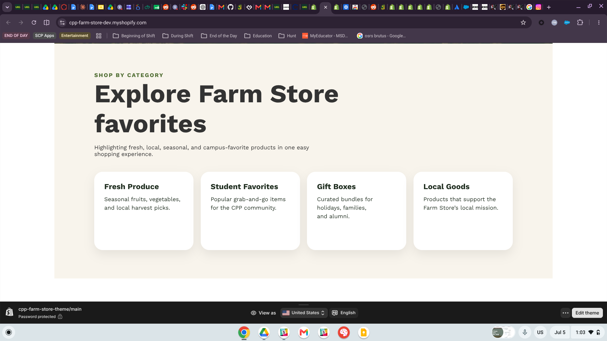{#fig-categories}

## Featured Products

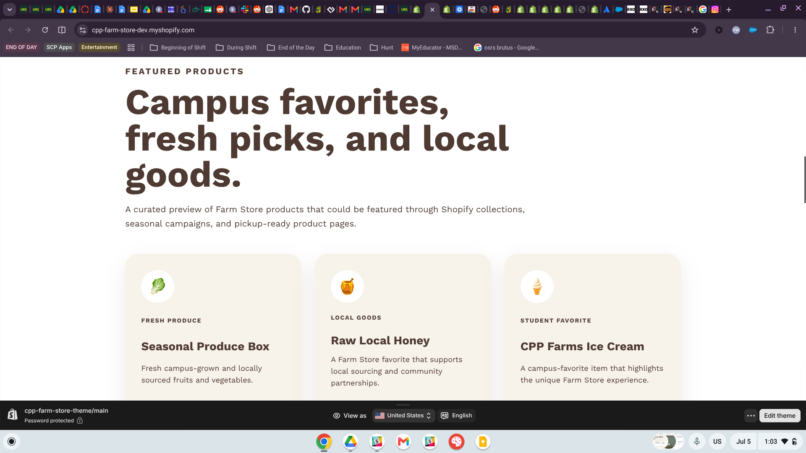{#fig-featured}

## Seasonal Banner

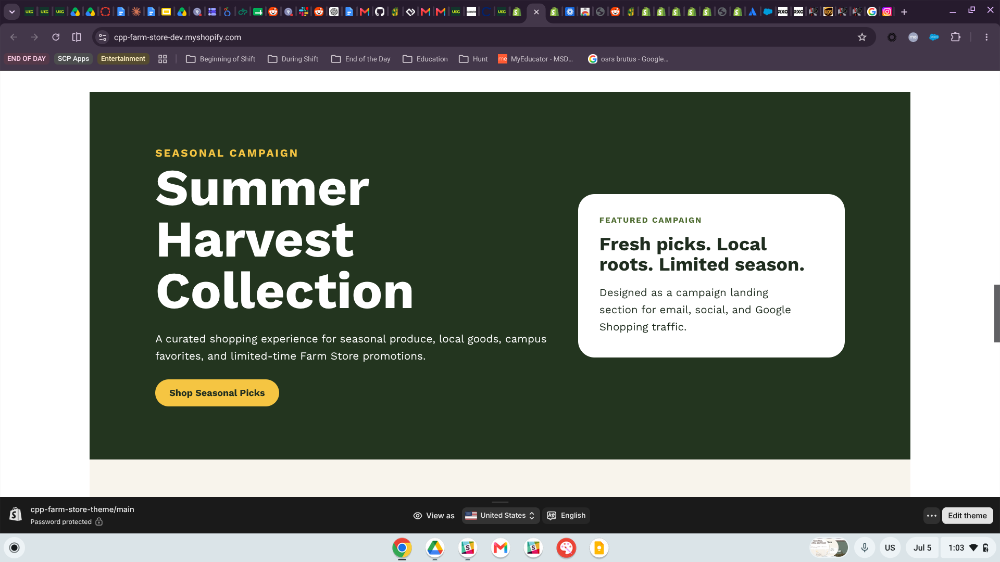{#fig-seasonal}

## Newsletter

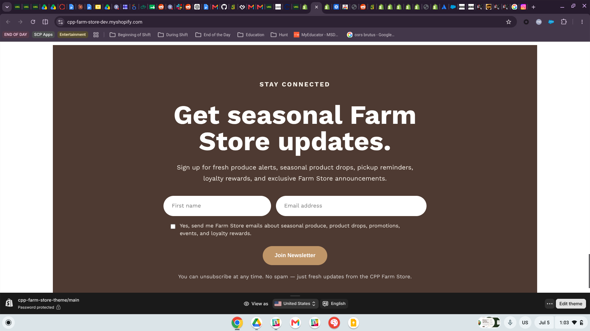{#fig-newsletter}

## Footer

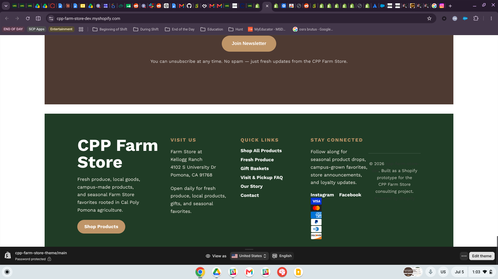{#fig-footer}
:::

# Product and Collection Page Examples {#sec-product-and-collection-page-examples}

Each product page should use customer-oriented language. A strong product page explains what the item is, who it is for, why it is appealing, and how the customer can receive it. For gift products, the page should also include preparation time, pickup/shipping limitations, card message fields, allergy notes, and substitution disclaimers.

| Product/Collection Example | Category | Customer Need | Recommended Product Page Details | CTA |
|--------------|--------------|--------------|----------------|--------------|
| Seasonal Produce Box | Fresh Produce | Healthy local food and seasonal discovery. | Includes seasonal produce, pickup information, availability note, and substitution disclaimer. | Order for Pickup |
| Raw Local Honey | Specialty Foods | Local goods and giftable pantry item. | Explain local sourcing, usage ideas, size, price, and pickup/shipping eligibility. | Add to Cart |
| CPP Farms Ice Cream | CPP Favorites | Campus favorite and unique store experience. | Include flavor, size, cold-storage/pickup note, and campus connection. | View Product |
| Deluxe Theme Gift Box (\$75) | Gift Baskets | Occasion-based gifting for families, alumni, staff, and visitors. | Include item list, card message, pickup date, allergy notes, 1–2 business day prep, and no-shipping disclaimer. | Customize Basket |
| Breakfast Theme Gift Box (\$50) | Gift Boxes | Gift box option with possible shipping. | Include product examples, recipient information, shipping note, payment/shipping follow-up disclaimer, and no PO Boxes policy. | Customize Box |
| Avocado/Satsuma Box | Fruit Box | Produce-focused gift or seasonal fruit bundle. | Include item list, freshness note, produce-shipping disclaimer, pickup/shipping date, and substitution note. | Order Fruit Box |
| Local Cold Brew | Student-Friendly Snacks | Convenience for students, staff, and campus visitors. | Include size, flavor, grab-and-go value, and pickup/in-store availability. | View Product |
| Farm Store Salsa | Specialty Foods | Pantry staple and local flavor. | Include flavor profile, serving ideas, size, and pairing suggestions. | Add to Cart |

: Product page plan

## Product Page Evidence

::: panel-tabset
## CPP Farms Ice Cream

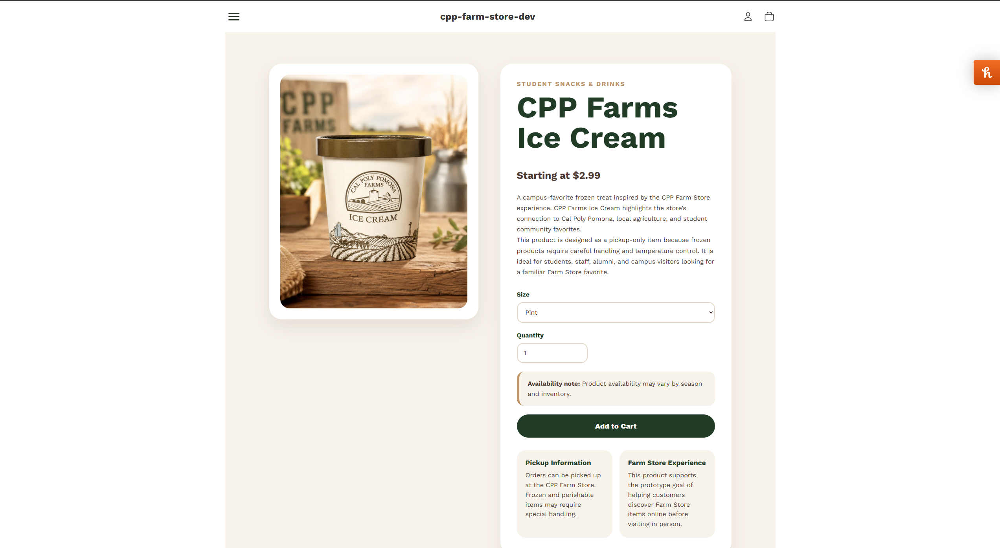{#fig-icecream}

## Seasonal Produce Box

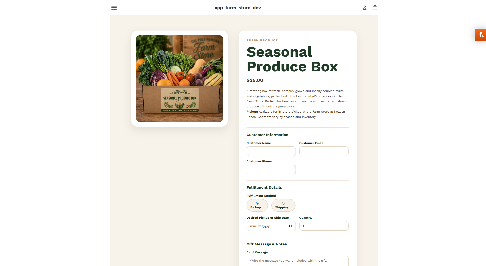{#fig-producebox}

## Raw Local Honey

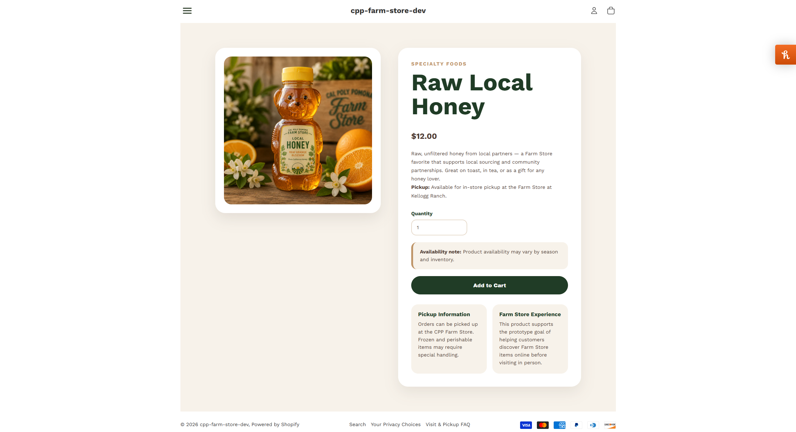{#fig-honey}

## Breakfast Theme Gift Box

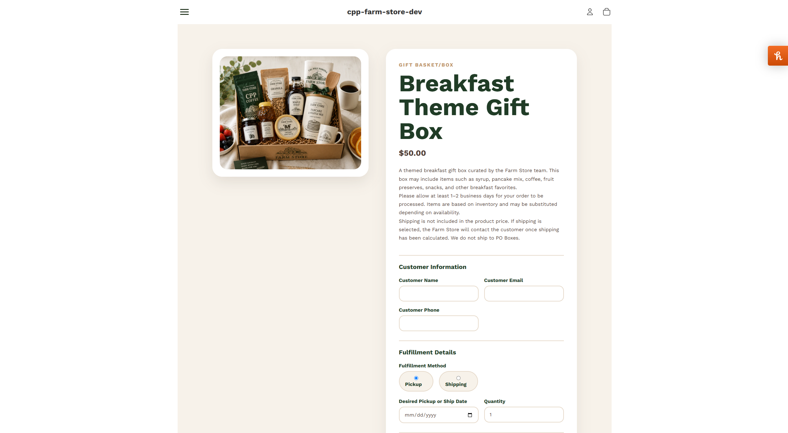{#fig-breakfast}

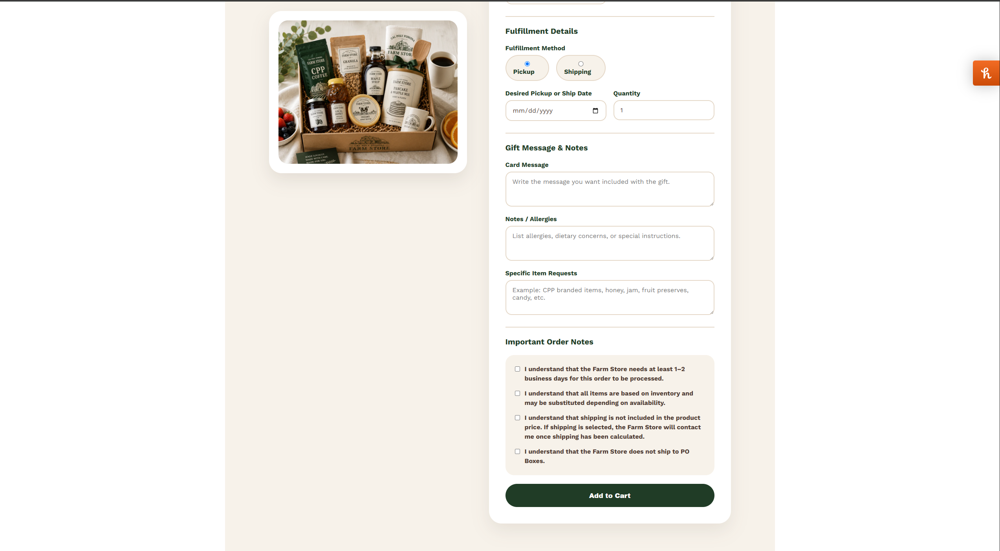{#fig-giftform}

## Deluxe Theme Gift Box

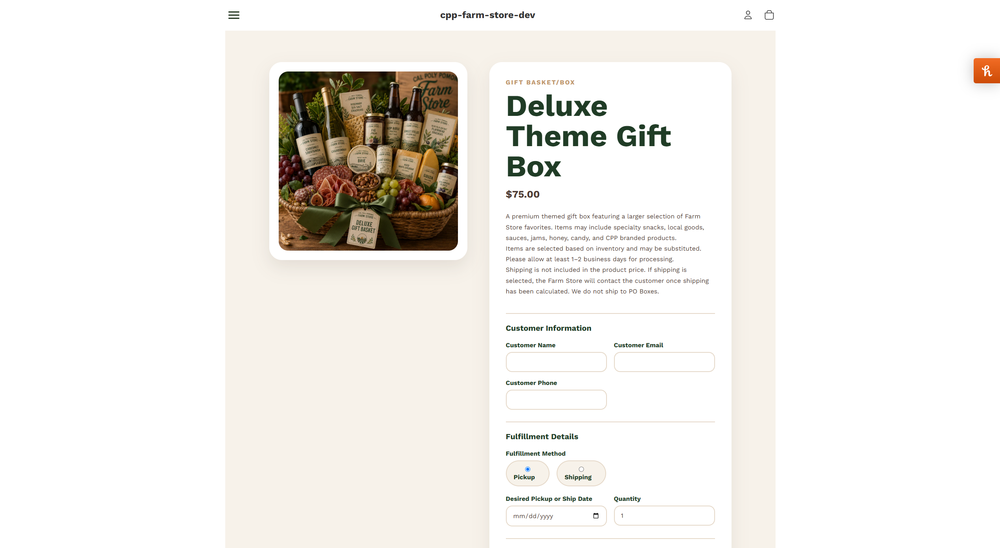{#fig-deluxe}
:::

::: {.callout-note title="Policy-to-product connection"}
The gift order form in @fig-giftform directly implements the service policies documented on the FAQ page (@fig-faqmap): 1–2 business day preparation, inventory-based substitutions, shipping-cost follow-up, and the no-PO-Box rule. Customers acknowledge each policy before adding a gift to the cart, reducing post-purchase service issues.
:::

## Collection Page Evidence

::: panel-tabset
## Fresh Produce

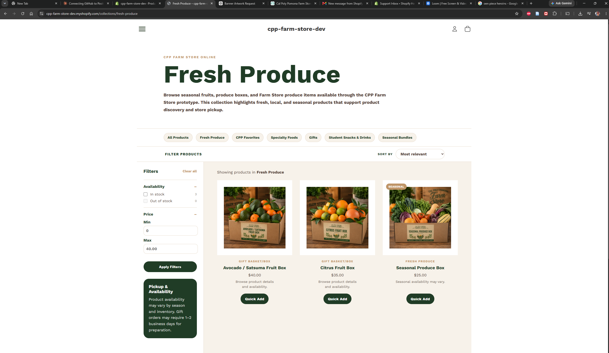{#fig-col-produce}

## Specialty Foods

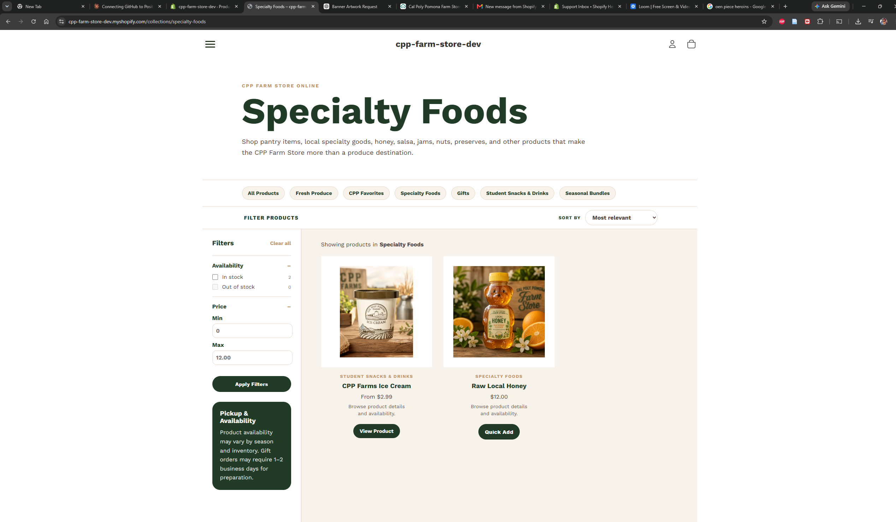{#fig-col-specialty}

## Gifts

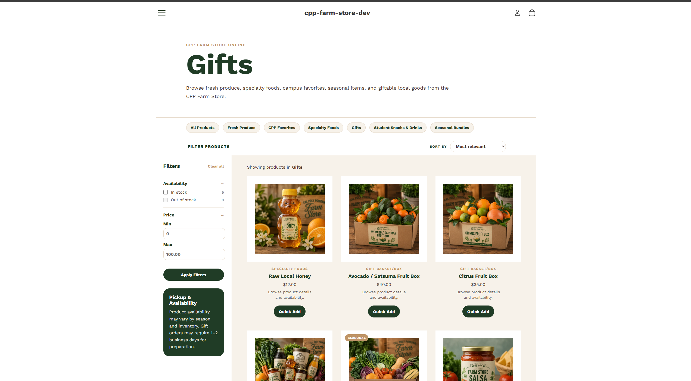{#fig-col-gifts}
:::

# Navigation and Usability {#sec-navigation-and-usability}

The navigation should make the store easy to browse by category and by customer intent. For this prototype, navigation should prioritize shopping paths, gift paths, pickup clarity, and store information.

| Recommended Navigation Item | Purpose |
|----------------------|--------------------------------------------------|
| Shop All Products | Broad browsing path for customers who want to see everything in the prototype. |
| Fresh Produce | Direct path for customers interested in seasonal, healthy, and locally sourced products. |
| Specialty Foods | Path for pantry items, honey, jams, salsa, snacks, and local goods. |
| Gift Baskets / Gifts | High-value path for gift buyers and seasonal bundle shoppers. |
| CPP Favorites | Highlights campus-made and campus-connected items. |
| Visit & Pickup FAQ | Clarifies store location, pickup, gift preparation time, shipping limitations, and contact information. |
| Our Story | Communicates local/community positioning and Farm Store identity. |
| Contact | Provides customer support and order inquiry path. |

: Navigation plan

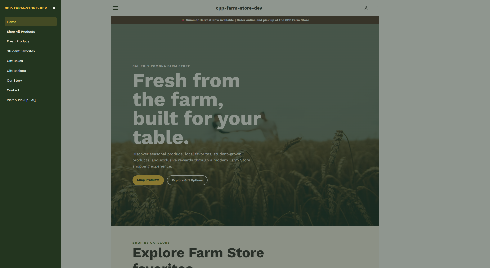{#fig-nav}

# Trust and Service Information

Customer transparency is a major part of the prototype. Customers need service information before buying, especially when products are perishable, seasonal, pickup-based, or gift-oriented. The prototype addresses this through a Visit, Pickup & Gift Order FAQ page, a Contact page, an Our Story page, and footer navigation links.

| Information Type | Prototype Content | Customer Experience Value |
|------------------|--------------------------|----------------------------|
| Store location | Farm Store at Kellogg Ranch, 4102 S University Dr, Pomona, CA 91768. | Reduces visit uncertainty and connects online browsing to the physical store. |
| Store hours | Customers should check current hours before visiting. | Prevents disappointment due to changing schedules or seasonal hours. |
| Pickup information | Eligible orders and gift orders may be available for pickup; some require 1–2 business days. | Clarifies timing and expectations before checkout. |
| Gift order policy | Gift items are based on inventory and may be substituted. | Builds trust and manages customer expectations. |
| Shipping limitations | Gift baskets cannot be shipped; some gift boxes may be eligible; no PO Boxes. | Prevents confusion and reduces post-order service issues. |
| Returns/exchanges | Perishable items may not be eligible for return; customers should contact the store for missing/damaged items. | Adds support clarity and protects operations. |
| Contact information | Customers should use website, order confirmation, Google listing, or official store page. | Provides a path to resolve questions. |
| Local/community story | The Farm Store connects campus agriculture with the surrounding community. | Strengthens brand fit and differentiates from grocery competitors. |

: Trust and service information plan

::: panel-tabset
## Our Story

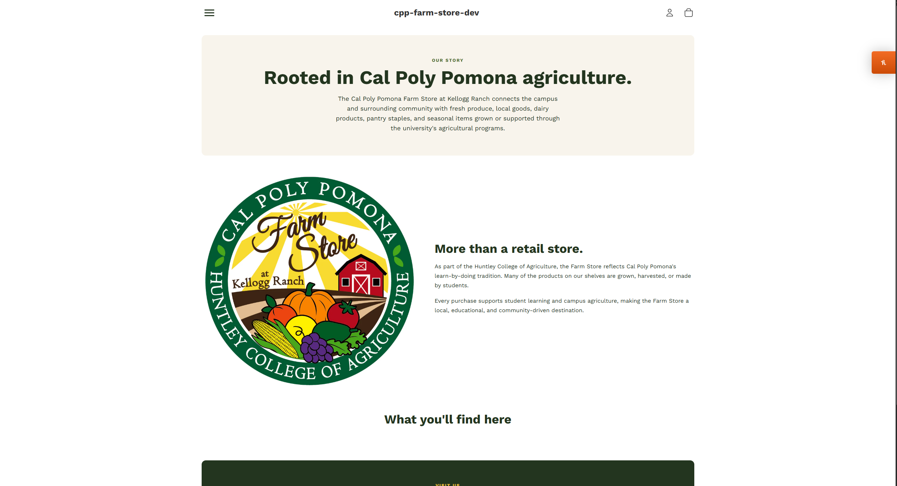{#fig-ourstory}

## FAQ + Map

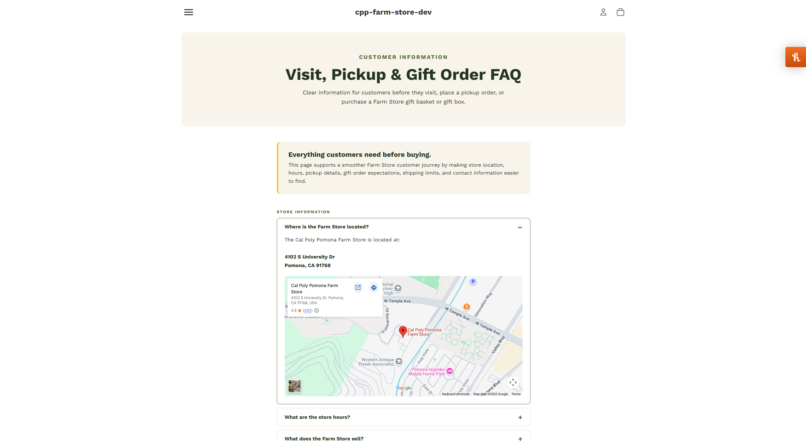{#fig-faqmap}

## FAQ Policies

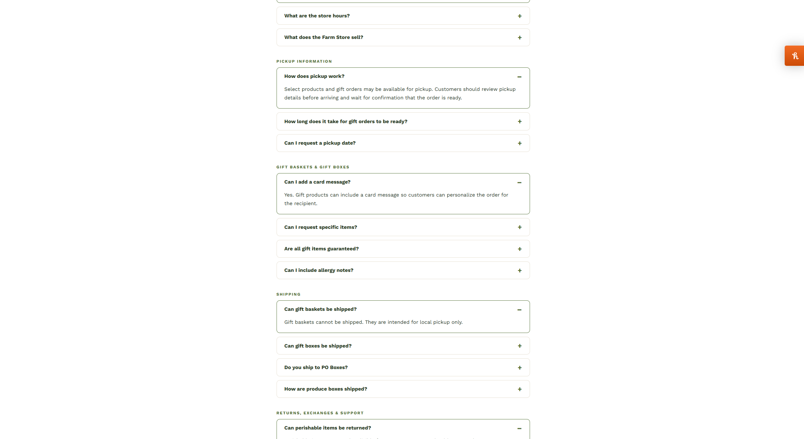{#fig-faqpolicies}

## Contact

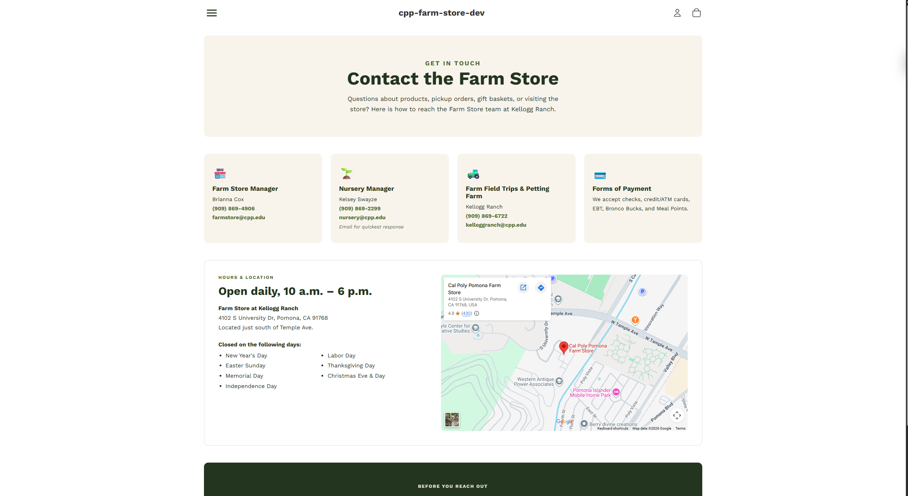{#fig-contact}
:::

# Ecommerce Strategy {#sec-ecommerce-strategy}

The ecommerce strategy for the CPP Farm Store Shopify prototype is designed to improve product discovery, simplify the shopping experience, and encourage customers to visit the physical Farm Store. Instead of just serving as a replacement for the in-store experience, the Shopify mini-store extends it by providing an organized, mobile-friendly platform where customers can browse products, explore seasonal collections, and learn more about campus-grown and locally sourced items.

The prototype is designed around the needs of two primary customer segments identified in GP1: CPP students and local community members. Students will benefit from a streamlined shopping experience that allows them to quickly browse products between classes, view pickup information, and discover campus-exclusive items. Local community members can explore fresh produce, specialty foods, gift baskets, and seasonal products while learning about the Farm Store's connection to Cal Poly Pomona and local agriculture.

In addition, the homepage emphasizes featured collections, seasonal promotions, and campus exclusive products to encourage product discovery and increase customer engagement. Organized navigation makes it easy for shoppers to browse categories such as Fresh Produce, CPP Favorites, Specialty Foods, Gift Baskets, and Seasonal Items. Product pages provide detailed descriptions, pricing, images, and pickup information to help customers make informed purchasing decisions.

The Shopify prototype also supports an omnichannel shopping experience by connecting online browsing with in-store pickup. Clear calls to action, pickup instructions, store hours, and contact information reduce customer uncertainty and create a seamless transition from digital discovery to in-store fulfillment.

**Strategic priorities:**

- Improve product discovery through featured categories and product cards.
- Promote seasonal items through homepage banners and limited-time product sections.
- Support gift buyers through gift basket, gift box, and fruit box product templates.
- Reduce customer confusion through pickup and shipping information.
- Reinforce brand fit through local, campus, agriculture, and community storytelling.
- Create an online-to-offline journey where ecommerce supports physical store visits and pickup.

# Connection to the Omnichannel Journey Map {#sec-connection-to-the-omnichannel-journey-map}

The Shopify prototype was intentionally designed using the findings from GP1. Each feature of the online store addresses a specific stage of the customer journey by reducing friction, improving product discovery, and creating a smoother transition from online browsing to in-store shopping and pickup.

The prototype directly responds to the omnichannel journey map by addressing discovery, consideration, purchase, pickup, post-purchase, and loyalty friction points. The store should not function as a stand-alone ecommerce site only; it should connect website browsing, physical-store visits, pickup support, seasonal communications, and loyalty/community engagement.

| Journey Stage | Customer Friction | Prototype Response | Strategic Outcome |
|-----------------|-------------------|-------------------|-------------------|
| Awareness | Customers may not know CPP Farm Store carries certain products. | Homepage hero, featured collections, seasonal banner, and product storytelling. | Improves discovery and gives customers a reason to explore. |
| Consideration | Customers need to know what products are available and why they matter. | Collection pages, product descriptions, product images/placeholders, and category organization. | Helps customers evaluate products before visiting or buying. |
| Purchase | Customers need a clear purchase or inquiry path. | Product pages with price, details, CTA, availability/pickup notes, and gift fields. | Makes ecommerce behavior easier and more actionable. |
| Pickup | Customers need clarity on readiness, pickup timing, and location. | FAQ page, pickup disclaimers, gift preparation notes, and footer information. | Reduces friction and service confusion. |
| Post-Purchase | Customers need support if items are unavailable, substituted, or damaged. | Substitution disclaimers, contact information, and support FAQ. | Builds trust and manages expectations. |
| Loyalty | Customers need reminders to return for seasonal products. | Newsletter section, seasonal product drops, loyalty messaging, and community story. | Supports repeat visits and long-term Farm Store engagement. |

: Journey stage responses

# Brand Fit with CPP Farm Store {#sec-brand-fit-with-cpp-farm-store}

The prototype aligns with CPP Farm Store's brand by emphasizing freshness, campus agriculture, local goods, seasonal products, and community connection. Visual choices such as earthy green, cream, brown, and gold tones support the farm/community feeling. Product choices also reflect the Farm Store's unique value: items connected to campus, local sourcing, fresh produce, and giftable specialty products.

> Compared with generic grocery ecommerce, this prototype should feel more local, educational, and community-rooted. The site should communicate that shopping at the Farm Store is not only a transaction; it is also a way to support Cal Poly Pomona agriculture, discover seasonal goods, and connect with a campus retail experience.

# Required Evidence and Screenshot Checklist

| Required Deliverable | Status | Notes / Location |
|-----------------------|-----------------|--------------------------------|
| Shopify store link or preview link | Complete | Preview URL and password in the [Appendix](#appendix-a-links). |
| Homepage screenshot | Complete | @fig-hero and @fig-categories through @fig-footer. |
| Navigation/menu screenshot | Complete | @fig-nav and footer in @fig-footer. |
| At least 5 product or collection examples | Complete | Five product pages (@fig-icecream, @fig-producebox, @fig-honey, @fig-breakfast, @fig-deluxe) plus three collection pages. |
| Explanation of target customer | Complete | @sec-target-customers. |
| Explanation of ecommerce strategy | Complete | @sec-purpose-of-the-mini-store and @sec-ecommerce-strategy. |
| Connection to omnichannel journey map | Complete | @sec-connection-to-the-omnichannel-journey-map and GP1 link in the Appendix. |
| Professional presentation | Complete | TOC, numbered sections, tables, tabsets, callouts, footnote, cross-references, and appendix links throughout. |

: Deliverable checklist

# Product Descriptions

**Seasonal Produce Box** — Enjoy a rotating assortment of fresh, seasonal fruits and vegetables grown at Cal Poly Pomona and local partner farms. Each box is carefully selected based on seasonal availability, giving customers the freshest produce while supporting local agriculture. Available for in-store pickup; contents may vary depending on the season.

**Raw Local Honey** — Pure wildflower honey sourced from local producers and selected for its rich flavor and natural sweetness. Perfect for tea, baking, breakfast, or gifting. Available for in-store pickup while supplies last.

**CPP Farms Ice Cream** — A Farm Store favorite made with quality ingredients and inspired by the Cal Poly Pomona community. Available in a variety of flavors and ideal for students, families, and campus visitors looking for a refreshing treat. Available for in-store pickup only.

**Deluxe Theme Gift Box** — A thoughtfully curated premium gift box featuring seasonal Farm Store favorites, locally sourced products, and campus-inspired specialties. Great for holidays, alumni, faculty, and family gifts. Gift orders require 1–2 business days to prepare, and items may be substituted based on inventory.

**Breakfast Theme Gift Box** — Start the day with a collection of breakfast favorites, including locally sourced products and Farm Store specialties. Perfect as a gift for family, friends, or colleagues. Shipping availability may vary, and customers should allow additional preparation time for custom orders.

**Avocado/Satsuma Box** — A seasonal fruit box featuring fresh avocados, satsumas, or other locally grown citrus depending on availability. An excellent option for customers looking to enjoy fresh California produce or send a thoughtful seasonal gift. Available for pickup; seasonal substitutions may apply.

**Local Cold Brew** — A smooth, ready-to-drink cold brew coffee perfect for students, faculty, and visitors looking for a convenient energy boost while on campus. Available as a grab-and-go beverage for in-store purchase or pickup.

**Farm Store Salsa** — A flavorful salsa made with quality ingredients and inspired by fresh California flavors. Perfect for chips, tacos, burritos, and everyday meals. Available for in-store pickup while supplies last.

# Rubric Alignment

| Grading Criteria | Points | Where This Report Addresses It |
|------------------------|----------------|--------------------------------|
| Clear ecommerce strategy | 15 | @sec-purpose-of-the-mini-store and @sec-ecommerce-strategy |
| Homepage quality | 15 | @sec-homepage-strategy plus homepage figures |
| Product page quality | 20 | @sec-product-and-collection-page-examples plus product figures |
| Navigation and usability | 15 | @sec-navigation-and-usability plus @fig-nav |
| Brand fit with CPP Farm Store | 15 | @sec-brand-fit-with-cpp-farm-store |
| Connection to omnichannel journey | 10 | @sec-connection-to-the-omnichannel-journey-map |
| Professional presentation | 10 | Entire document: TOC, numbered sections, tables, tabsets, callouts, and appendix links |

: Rubric alignment

# Appendix A: Links {#appendix-a-links}

| Link Type | URL / Detail |
|---------------------|---------------------------------------------------|
| Shopify Preview Link | <https://cpp-farm-store-dev.myshopify.com> |
| Store Password (instructor access) | `tairtu` |
| Published GitHub Pages Report | <https://mjshawell.github.io/cpp-farm-store-theme/assignments/Seis-Leches-GP2-Mini-Store-Prototype.html> |
| GitHub Repository | <https://github.com/mjshawell/cpp-farm-store-theme/tree/main/assignments> |
| Related GP1 Omnichannel Journey Map | <https://mjshawell.github.io/cpp-farm-store-theme/assignments/Group6-GP1-Omni-map.html> |

: Report and project links
