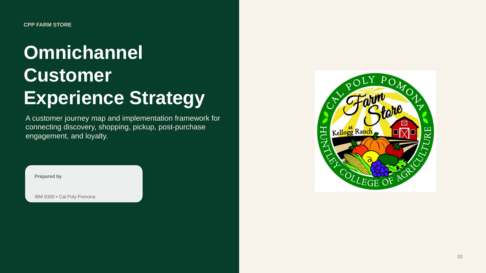{fig-align="center"}

## Purpose

The purpose of this assignment is to understand how customers currently discover, evaluate, purchase, receive, and engage with CPP Farm Store across different touchpoints. A strong omnichannel journey map should show how the physical store, website, search, social media, email, mobile, retail media, and post-purchase experiences connect.

This assignment is the foundation for the rest of the project. Our Shopify prototype, retail-media setup, campaign plan, creative assets, and dashboard should all respond to the opportunities identified in this journey map.

::: callout-important
## Key Question

**How can CPP Farm Store create a smoother, more connected customer journey across offline and online channels?**
:::

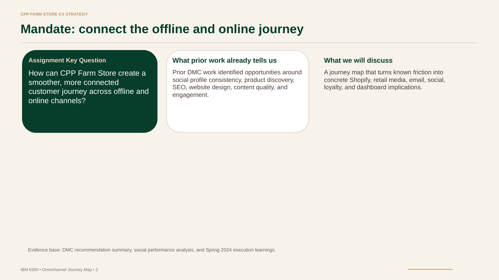{fig-align="center"}

## Step 1: Target Customer Segments {#sec-segments}

### CPP Students

CPP students are currently enrolled undergraduate and graduate students at Cal Poly Pomona. They are a diverse group who spend much of their time on campus and regularly use campus services and retail locations. They are also comfortable using digital platforms such as social media, on demand food delivery platforms and online shopping to find products and services.

### Local Community Members

Local community members include residents living in and around Cal Poly Pomona, including families, working professionals, and individuals who visit the area. They are interested in supporting local businesses and often shop for fresh produce, specialty foods, and locally made products. They are an important customer base that does not rely on the university community.

### Primary Persona: Emily Rodriguez

::: callout-note
## Emily Rodriguez — Primary Persona

Emily Rodriguez is a 22-year old CPP student who is mobile oriented, budget conscious and usually spends time shopping between classes. She wants a quick way to see what fresh, affordable, seasonal product is available for pickup.

Her main goals are to find store hours, product availability, prices, parking, pickup information, and seasonal items. She wants to feel confident that the CPP Farm Store is worth the trip and this also connects to her CPP campus pride. Her biggest barrier is unclear inventory, limited online product discovery, and disconnected promotions. Her purchase triggers include Instagram Reels, Google Listings, Seasonal Campaigns, student discounts, gift bundles, and friend recommendations.
:::

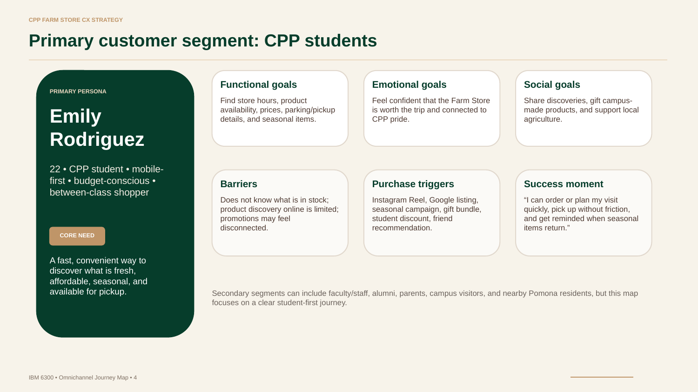{fig-align="center"}

### Micro-Personas: Secondary Journey Segments

::: panel-tabset
#### A — Campus Convenience Seeker

A student everyday buyer who is searching for quick meals, easy snacks, affordable groceries, and pickup options that are quick between classes. Best channels would include: Instagram, Google Maps, Shopify Pickup, and Campus Signage. This segment needs accurate hours, live inventory, simple pickup, and mobile friendly pages.

#### B — Proud CPP Gifter

An alumni, parent, or campus visitor looking for any CPP branded gifts, merchandise, local honey, handmade jams, campus wine, that legendary CPP Orange Juice and, of course, gift baskets! Best channels include Google Search, gift landing pages, email campaigns, events, and in store displays. This segment needs clear gift options, pricing, pickup/shipping details, and occasion based categories.

#### C — Local Food Supporter

A Pomona community shopper interested in seasonal produce, local goods, and supporting the Farm store's community mission. Best channels include Google Maps, SEO, Facebook, word of mouth, and email newsletters. This segment needs current inventory, seasonal availability, parking details, and recipe content (for health and safety purposes regarding allergies or personal beliefs).
:::

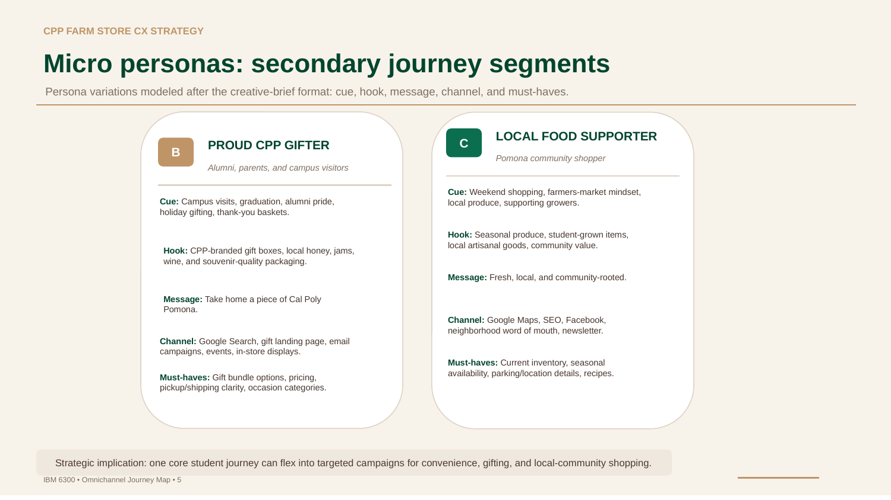{fig-align="center"}

### Competitive Context

Three competitors were benchmarked based on overlapping product categories and proximity to the CPP Farm Store area: Trader Joe's, Whole Foods Market, and Sprouts Farmers Market.

Sprouts is the most conceptually similar to CPP Farmstore, a farm fresh identity, midtier pricing, and a focus on natural or specialty products; Sprouts is also located approximately 10 minutes from campus off of Diamond Bar Blvd making it the most direct competitive threat for the local community shopper segment.

All Three of the competitors have capabilities that the CPP Farm Store currently lacks: e-commerce platforms, loyalty apps, and digital checkout via Apple Pay or Google Pay (without having to tap their phones). Whole Foods has the highest prices and the largest assortment. Trader Joes wins on everyday staple value with their private label marketing.

The CPP Farm store occupies a position that no other competitor can enter regardless of their price point, since their offer campus grown produce that is sourced directly from the university farm, with campus made exclusive products (CP Horseshoe Vineyard Wines, CPP Craft Beer, Fresh Nut Butters, Wildflower Honey, and of course the famous CPP Orange Juice!), and a genuine educational and community oriented mission area brand mission that is unreplicable. Shared products overlap exists in the cheeses, deli, and pick categories, but the CPP campus exclusives are the CPP Farm Store's true competitive advantage, and should anchor every digital channel and campaign.

## Step 2: Customer Goals {#sec-goals}

### CPP Students

- Purchase healthy snacks, drinks, and meals between classes.
- Buy fresh produce and locally made products.
- Find affordable food and campus merchandise.
- Learn about seasonal products and special promotions.
- Place orders online for quick pickup.
- Earn rewards and discounts through loyalty programs.

### Local Community Members

- Purchase fresh, locally grown produce and specialty foods.
- Support Cal Poly Pomona and local agriculture.
- Shop for seasonal and locally made products.
- Find unique gifts and food items.
- Stay informed about Farm Store events and promotions.
- Enjoy a convenient shopping experience both online and in-store.

## Step 3: Journey Stages {#sec-journey}

For each stage, identify what the customer is doing, thinking, feeling, and needing.

| Stage | Actions | Thoughts | Feelings | Needs |
|---------------|---------------|---------------|---------------|---------------|
| **Awareness** | Discover the Farm Store through Google, Instagram, or campus signage. | "I didn't know CPP had a Farm Store." | Curious | Learn about the store, location, and products. |
| **Consideration** | Browses products, hours, and seasonal offerings. | "Do they have what I need?" | Interested | Product availability, pricing, and store information. |
| **Purchase** | Shops in-store or places an online order. | "Can I buy this easily?" | Motivated | Fast, mobile-friendly checkout and payment options. |
| **Fulfillment / Pickup** | Picks up the order or shops in-store. | "Where do I go?" | Satisfied | Clear pickup instructions and parking information. |
| **Post-Purchase** | Uses products and follows updates. | "I'd like to know what's new." | Happy | Recipes, promotions, and seasonal updates. |
| **Loyalty** | Returns for seasonal items and recommends the store. | "I'll come back." | Loyal | Rewards, reminders, and ongoing communication. |

: Customer Journey Stage Overview

### Emotion Scores and Customer Needs by Stage

Based on field visit observations and assessment of the current digital experience, the following emotion scores reflect the student segment's journey today:

::: panel-tabset
#### Awareness — 2/5

**Curious but unlikely to act; low digital visibility**

Customer Needs: Clear information about the Farm Store's existence, location, hours, and unique products. They should be able to quickly understand why the Farm Store is different from other grocery retailers.

#### Consideration — 2/5

**Interested but blocked; no browsable catalog or inventory info**

Customer Needs: Accurate product availability, pricing, store hours, and seasonal inventory information so they can decide whether visiting the Farm Store is worthwhile.

#### Purchase — 1/5

**Frustrated; no digital path to transact without a phone call**

Customer Needs: A simple, mobile-friendly purchasing experience with clear payment options and an easy checkout process, whether shopping online or in person.

#### Fulfillment/Pickup — 4/5

**Satisfied; in-store service is warm, personal, and community-driven**

Customer Needs: Clear pickup instructions, parking information, order confirmation, and timely updates so they can collect their purchases without confusion.

#### Post-Purchase — 3/5

**Happy with the product but disconnected; no follow-up**

Customer Needs: Follow-up communication, product recommendations, recipes, and updates on seasonal products to remain engaged after their purchase.

#### Loyalty — 2/5

**No loyalty mechanism to reinforce the relationship**

Customer Needs: Incentives to return, including promotions, loyalty rewards, seasonal reminders, and consistent communication that strengthens their connection to the CPP Farm Store.
:::

> The emotional low point is the purchase stage, a student who discovers the store on Instagram and wants to buy something has no path to complete their transaction. Solving this single gap has the highest impact on overall journey satisfaction.

## Step 4: Touchpoints {#sec-touchpoints}

Customers interact with the CPP Farm Store through both digital and physical touchpoints throughout their customer journey. These touchpoints work together to create a seamless omnichannel experience.

### Omnichannel Ecosystem Overview

| Stage | Primary Channels |
|------------------------------------|------------------------------------|
| **Discovery** | Google Search, Google Maps, Instagram, campus signage, word of mouth |
| **Evaluation** | CPP Farm Store website / Shopify store, product pages, seasonal content, reviews |
| **Transaction** | Online cart, in-store POS, mobile checkout, Apple Pay, Google Pay, student discounts |
| **Fulfillment** | Store visit, BOPIS pickup counter, staff support, packaging, parking |
| **Retention** | Email automation, SMS, loyalty rewards, events, UGC and reviews |

: Omnichannel Channel Map

> Omnichannel principle: each channel should reduce friction for the next step rather than operating as a separate experience.

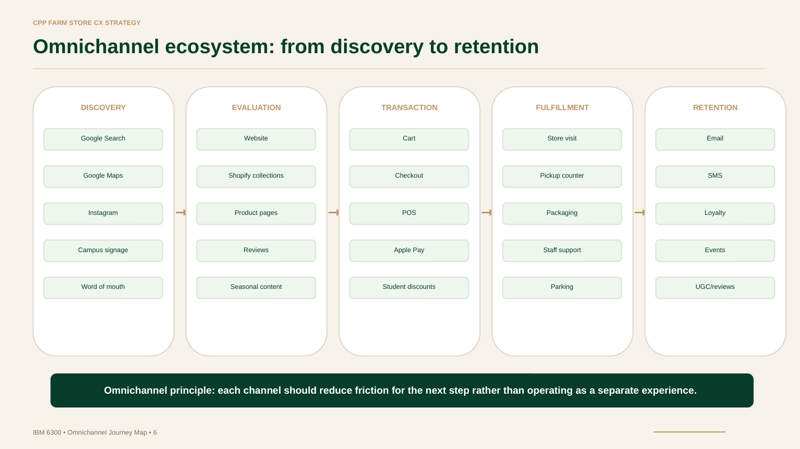{fig-align="center"}

::: panel-tabset
#### Awareness

- Google Search
- Google Maps
- Instagram and other social media
- Campus events
- Community events
- Word of mouth
- Campus signage and flyers

#### Consideration

- CPP Farm Store website
- Online product listings
- Google Merchant Center
- Google Maps
- Social media pages
- Store signage

#### Purchase

- CPP Farm Store physical location
- Mobile website
- Online checkout
- In-store checkout

#### Fulfillment / Pickup

- CPP Farm Store physical location
- Order confirmation emails
- Pickup instructions
- Parking and directional signage
- Staff assistance

#### Post-Purchase

- Follow-up emails
- Social media
- Product packaging
- Customer reviews
- Rewards program

#### Loyalty / Repeat Purchase

- Email newsletters
- Loyalty and rewards program
- Social media
- Google Search
- Seasonal promotions
- Campus and community events
- Personalized offers
:::

## Step 5: Pain Points {#sec-pain}

::: callout-important
## Highest-Impact Pain Point

The **Conversion Gap** is the most structurally significant friction point. A student who discovers the store on Instagram and wants to make a purchase has no frictionless digital path to complete that transaction — every order currently requires a phone call or email.
:::

- **Discovery Gap: Customers do not know where the store exists.**
  - The CPP Farm Store's Google Business Profile exists but is under-optimized. Instagram content is posted inconsistently with no regular posting schedule. There is no paid discovery channel. Campus signage is limited to the immediate Kellogg Ranch Area, where students don't regularly pass.
- **Product Visibility Gap: Products are not easy to browse online.**
  - The current website isn't functioning as a browsable product catalog. There are six distinct product lines that exist on the site (campus grown produce, campus made specialty items, artisanal cheese and dips, deli and charcuterie, pickles and fermented foods, and gift baskets).
- **Conversion Gap: No Clear Digital Path to Purchase.**
  - All ordering is currently manual, with orders being taken by phone or email, and payments are completed via Zelle or over the phone; because of this system gift baskets require 24-48 hours of advanced notice because they are custom assembled on site. There is currently no e-commerce checkout such as Apple pay or Google pay at the POS (although through Zelle they accept them as forms of payment), and no BOPIS workflow. All three major competitors offer digital checkout infrastructure that the Farm Store is currently lacking.
- **Pricing Gap: Prices are outdated and need to be Updated.**
  - Field visit observations and a conversation with the store manager confirmed that several product categories are priced far below the market rate. This gap the manager is actively working to correct by updating their inventory and the prices at the same time. Campus made products (wine, craft beer, nut butters) are particularly underpriced in relation to their scarcity and exclusivity being a CPP product. No Digital channel is currently surfacing the value proposition of these items.
- **Retention Gap: There is no System to Maintain Contact.**
  - There is no post purchase email sequence, no review prompts, no restock notifications, and the loyalty program is unreliable (a punch card) with no referral program. Once a customer leaves the store, there is no digital method of communication to bring them back for more.

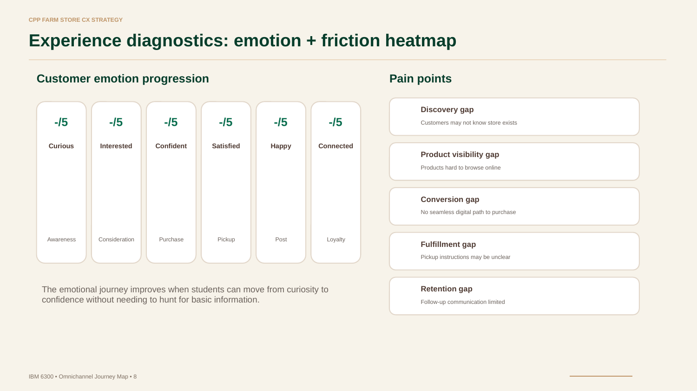{fig-align="center"}

## Step 6: Omnichannel Opportunities {#sec-opps}

- **Discovery Gap:** Optimize the Google Business Profile with updated hours, product photos, and categories. Improve SEO and maintain a consistent Instagram posting schedule featuring seasonal products, campus-made items, and events. Search campaigns should focus on exclusive items unique to the farm store. Install QR code signage around high-traffic campus locations that links directly to the website or Google Maps listing.

- **Product Visibility Gap:** Develop a Shopify storefront with organized product categories, seasonal collections, high-quality product images, descriptions, pricing, and inventory updates. Highlight exclusive CPP products to encourage purchases.

- **Conversion Gap:** Implement a Shopify e-commerce platform with mobile-friendly checkout, Apple Pay, Google Pay, and Buy Online, Pick Up In Store (BOPIS). Add automated order confirmations and pickup instructions.

- **Pricing Gap:** Update pricing to better reflect product value while emphasizing the uniqueness of campus-made items through product descriptions, storytelling, featured collections, and seasonal marketing campaigns.

- **Retention Gap:** Launch automated email campaigns with order confirmations, recipes, seasonal updates, review requests, and restock notifications. Introduce digital loyalty and referral program to encourage repeat purchases and strengthen long-term customer relationships.

- **Implementation Roadmap:** These opportunities can be implemented in three phases. Phase 1 (Foundation) focuses on improving customer discovery and trust through Google Business Profile optimization, SEO, Instagram content, and campus signage. Phase 2 (Commerce) focuses on developing the Shopify storefront, online product catalog, mobile checkout, and Buy Online, Pick Up In Store (BOPIS). Phase 3 (Activation) emphasizes customer retention through Google Shopping campaigns, automated email marketing, loyalty programs, and KPI dashboards that measure customer engagement and repeat purchases.

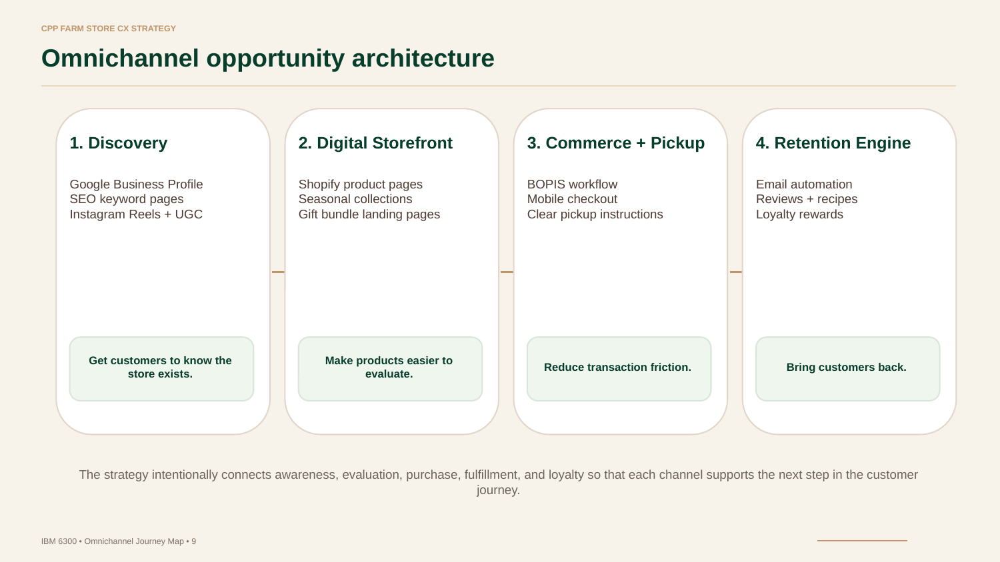{fig-align="center"}

## Step 7: Visual Journey Map {#sec-map}

The visual journey map below summarizes the student-first omnichannel path across all six stages — from initial awareness through long-term loyalty — capturing the key action, thought, friction point, and opportunity at each stage.[^1]

[^1]: Visual journey map created in PowerPoint as part of the IBM 6300 Group Project 1 deliverable. CPP Farm Store CX Strategy, Spring 2026.

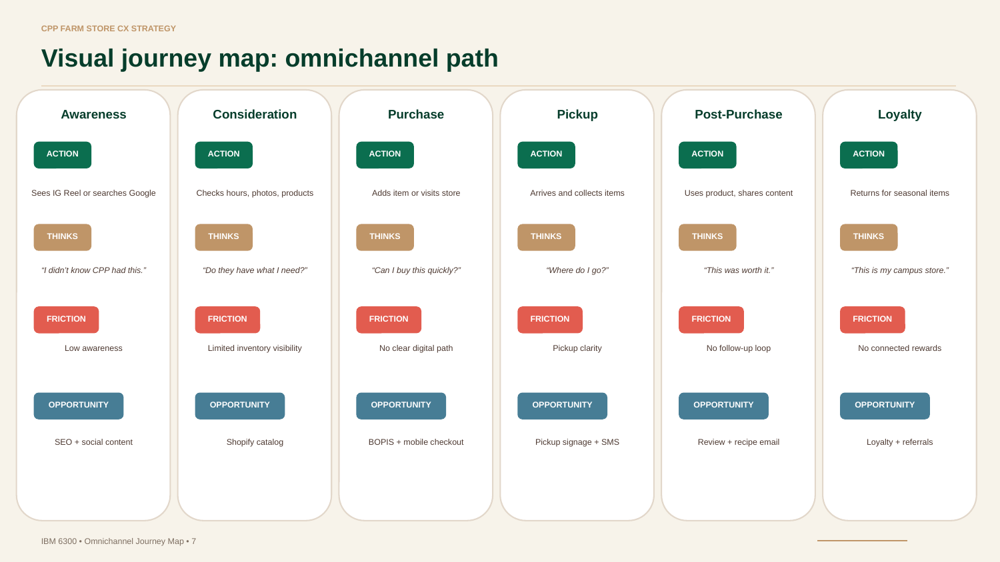{fig-align="center"}

### Measurement Framework

The KPI dashboard below maps measurable metrics to each stage of the customer journey, ensuring every friction point identified in this map can be tracked and improved over time.

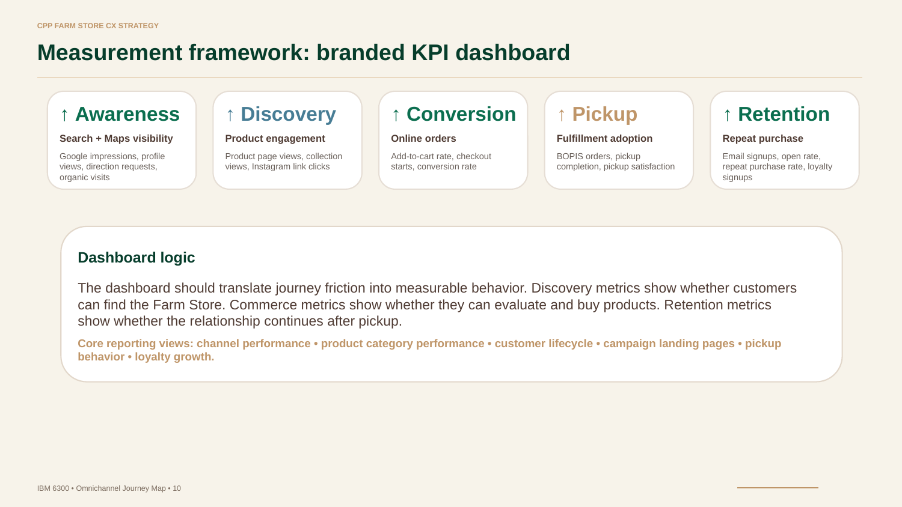{fig-align="center"}

| Journey Stage | Metric | Why It Matters |
|------------------------|------------------------|------------------------|
| **Awareness** | Google impressions, Maps views, profile clicks | Indicates whether discovery channels are working |
| **Consideration** | Product page views, collection views, IG link clicks | Indicates whether the catalog is compelling |
| **Purchase** | Add-to-cart rate, checkout starts, conversion rate | Indicates whether the transaction path is functional |
| **Fulfillment** | BOPIS orders placed, pickup completions | Indicates adoption of the new commerce infrastructure |
| **Retention** | Email open rate, repeat purchase rate, loyalty signups | Indicates whether the post-purchase relationship is working |

: GP5 Dashboard KPI Framework

> The dashboard should translate journey friction into measurable behavior. Discovery metrics show whether customers can find the Farm Store. Commerce metrics show whether they can evaluate and buy products. Retention metrics show whether the relationship continues after pickup.
>
> Core reporting views: channel performance • product category performance • customer lifecycle • campaign landing pages • pickup behavior • loyalty growth.

## Step 8: Strategic Implications for the Rest of the Project {#sec-implications}

This journey map serves as the strategic foundation for the remaining group deliverables. Each GP2-GP5 decision should connect directly back to a friction point identified in the customer journey above.

For **GP2, the Shopify Prototype** should focus on reducing any friction during the consideration and purchasing stages. Limited inventory visibility can be addressed through a clear/organized Shopify catalog, while the lack of a digital purchase path can be improved through BOPIS and mobile checkout. The catalog should be organized around the six observed product lines, with the campus exclusive SKUs featured prominently on the homepage.

Regarding **GP3, the Retail Media Setup** should address the awareness gap through SEO and Social media content. Google Shopping and Search campaigns should center on campus exclusive products (seasonal citrus, avocados, campus wine, CPP craft beer). These products are especially valuable because of their uniqueness to the CPP Farmstore, meaning competitors can't replicate the same authenticity or campus connection.

For **GP4, the Campaign Plan and Creative Assets** should connect the awareness and loyalty stages by building a stronger SEO, social, loyalty, and referral strategies. Seasonal product drops, campus identity content, and gift bundle campaigns can serve as the three main creative pillars because they align most clearly with the customer motivation identified in the persona work.

Finally, with **GP5, the Analytics Dashboard** should make the strategy measurable by assigning a KPI to each stage of the journey map. Awareness can be tracked through Google impressions and Map views, consideration through product page views, purchase through checkout conversion rate, pickup through BOPIS completion rate, post-purchase engagement through email open and repeat purchase rates, and loyalty through loyalty program signups.

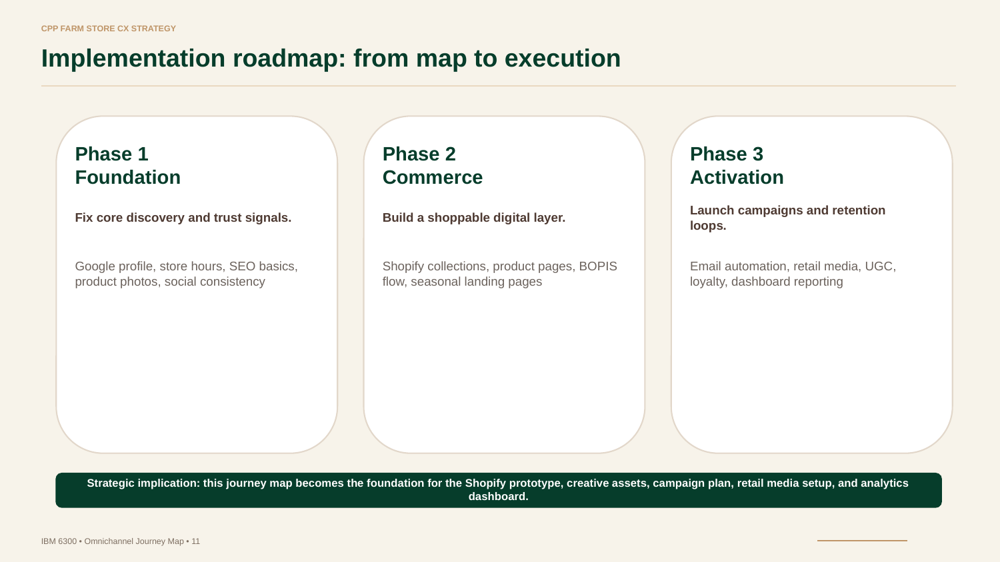{fig-align="center"}

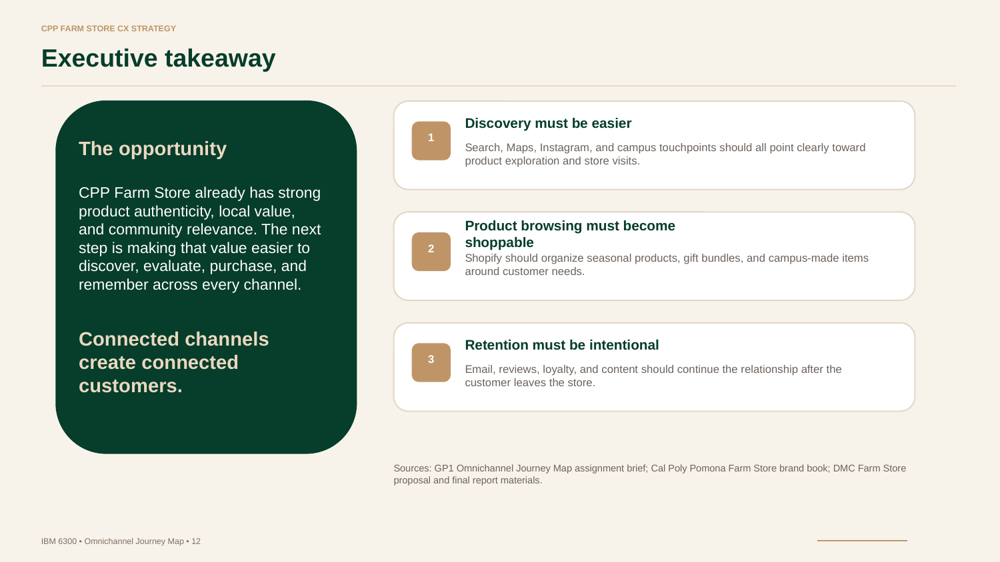{fig-align="center"}

## Appendix {.unnumbered}

### Grading Criteria {.unnumbered}

| Criterion | Points Possible | Where Addressed |
|------------------------|------------------------|------------------------|
| Clear target customer segment | 15 | @sec-segments |
| Complete journey stages | 15 | @sec-journey |
| Strong identification of touchpoints | 15 | @sec-touchpoints |
| Insightful pain points | 20 | @sec-pain |
| Practical omnichannel opportunities | 20 | @sec-opps |
| Visual clarity and professionalism | 15 | @sec-map, tables, callouts throughout |
| **Total** | **100** |  |

: Rubric Self-Assessment

### Project Links {.unnumbered}

::: callout-note
## Group Project Links

- **GitHub Repository:** <https://github.com/mjshawell/cpp-farm-store-theme>\

- **GitHub Page:** [https://github.com/mjshawell/Group6-GP1-Omni-map.html](https://mjshawell.github.io/cpp-farm-store-theme/assignments/Group6-GP1-Omni-map.html){.uri}
:::

### Sources {.unnumbered}

Sources: GP1 Omnichannel Journey Map assignment brief; Cal Poly Pomona Farm Store brand book; DMC Farm Store proposal and final report materials; field visit observations conducted Spring 2026.
