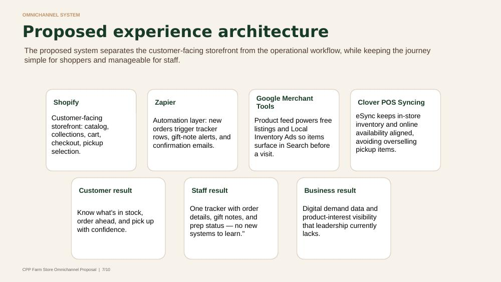
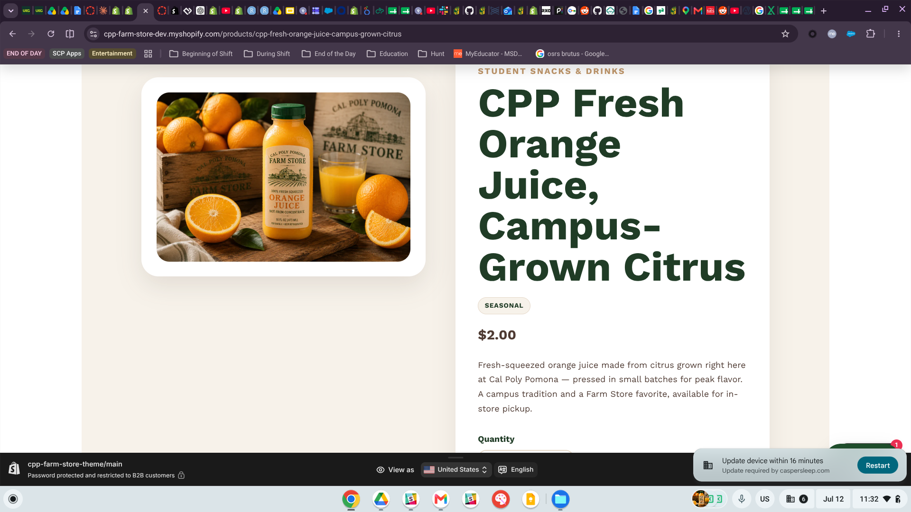
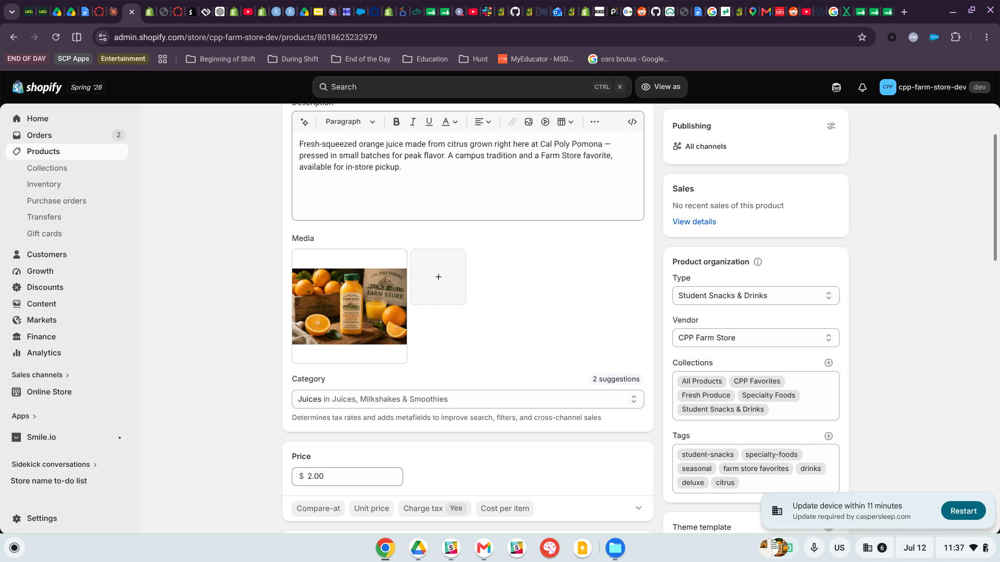
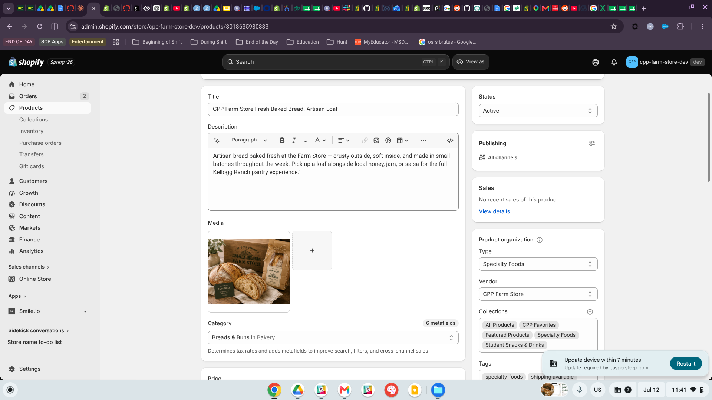
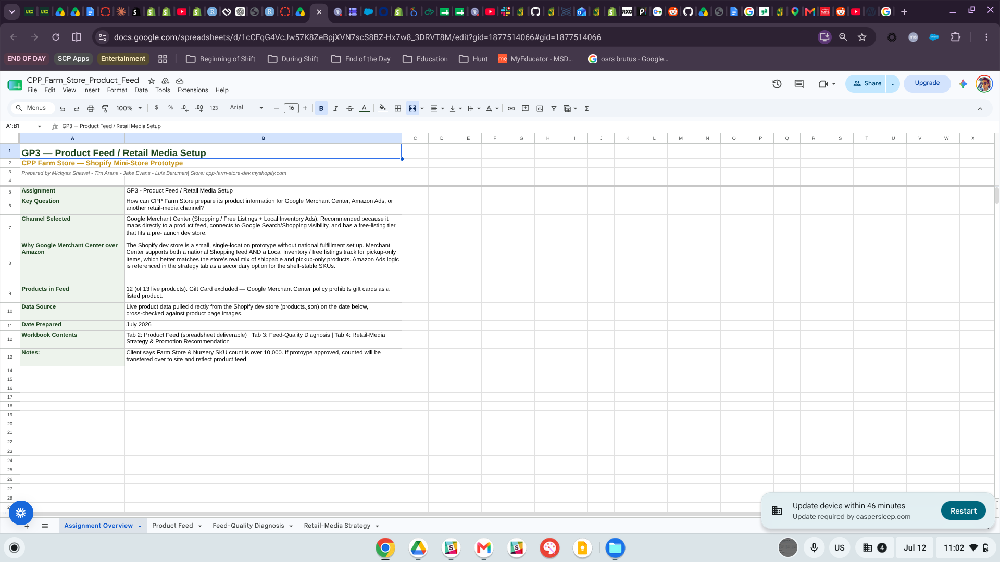

# Purpose and Key Question

This report prepares CPP Farm Store products for online visibility through a retail-media product-listing channel. It connects our Shopify mini-store prototype (`cpp-farm-store-dev.myshopify.com`) to digital promotion by building a structured product feed, diagnosing feed-quality problems, and recommending which products to promote first.

> **Key Question:** How can CPP Farm Store prepare its product information for Google Merchant Center, Amazon Ads, or another retail-media channel?

The guiding principle behind this deliverable is simple: **a product cannot perform well in retail media if its underlying data is broken.** Before a single advertising dollar is spent, the product information itself — titles, prices, images, identifiers, availability — must be complete, consistent, and structured the way the channel requires. Our work below shows that this is not a hypothetical concern: the audit surfaced feed-rejecting errors, a policy-violating image, and even two products that our own strategy referenced but that did not exist in the store yet.

::: callout-note
## Deliverables in this report

This report contains all four required deliverables: the **product feed spreadsheet** (@sec-feed, with the full Excel workbook linked in @sec-workbook), the **retail-media setup explanation** (@sec-channel and @sec-strategy), the **feed-quality diagnosis** (@sec-diagnosis), and the **recommendation for which products to promote first** (@sec-recommendation).
:::

# Project Context: Where GP3 Fits {#sec-context}

CPP Farm Store — the Farm Store at Kellogg Ranch — is a campus-connected specialty food retailer bringing together student-grown agriculture, fresh produce, local goods, gifts, and seasonal products, rooted in Cal Poly Pomona's "learn by doing" culture.[^1] Our group's broader proposal builds an omnichannel prototype for the store: a Shopify mini-store for discovery and pickup ordering, Zapier for operations automation, Clover POS syncing for inventory alignment, and — the subject of this assignment — **Google Merchant tools so products surface in Search before a customer ever visits.**

[^1]: Farm Store at Kellogg Ranch, 4102 S. University Dr., Pomona, CA 91768; open daily 10 a.m.–6 p.m. Source: CPP Farm Store official site and Instagram.

{#fig-architecture}

Within that architecture (@fig-architecture), this assignment is the bridge between the storefront and digital promotion. The proposal's success metrics include a feed-health target — every feed product approved in Merchant Center with zero critical errors (14/14 after the catalog-gap fix in @sec-products) — and the feed and diagnosis below are how that target becomes achievable rather than aspirational.

# Channel Selection and Retail-Media Logic {#sec-channel}

## Channel selected: Google Merchant Center

We selected **Google Merchant Center (GMC)**, using two connected tracks:

1.  **A free Shopping / product-listing feed** for shelf-stable and pickup-eligible items, giving them visibility in Google Search and the Shopping tab at zero media cost.
2.  **Local Inventory Ads (LIA) / free local listings** for perishable, pickup-only items, so products like the Seasonal Produce Box and CPP Farms Ice Cream surface for nearby searchers as "available for pickup at Kellogg Ranch."

## Why Google Merchant Center over Amazon

The Shopify dev store is a small, single-location prototype without national fulfillment set up. Merchant Center supports **both** a national Shopping feed **and** a local-inventory track for pickup-only items, which matches the store's real mix of shippable and pickup-only products far better than Amazon's fulfillment-centric model. Additional reasons:

- GMC maps directly onto a structured product feed, which is exactly the deliverable this assignment develops.
- The free-listings tier fits a pre-launch dev store with no advertising budget.
- GMC connects natively to the Shopify platform through the Google & YouTube sales channel, which matters for scale (see @sec-scale).
- Amazon listing logic remains a documented **secondary option** for the shelf-stable SKUs (salsa, honey) if the Farm Store later builds shipping operations.

::: callout-important
## Why the feed had to come first

Merchant Center actively rejects broken data: duplicate identifiers cause feed rejection, invalid price formats fail on upload, and misrepresentative images risk policy disapproval. Our Feed-Quality Diagnosis (@sec-diagnosis) exists so these problems get fixed **in Shopify** before any campaign drives traffic to a listing that would be disapproved.
:::

# Product Selection {#sec-products}

We selected **14 of the 15 live products** on the dev store — the full merchandisable catalog. One product was excluded deliberately:

- **Gift Card (id 7998550573139)** — Google Merchant Center policy prohibits gift cards as listed products.[^2] The listing also carries leftover Shopify demo data ("Snowboard Vendor," all variants unavailable) and needs cleanup in Shopify regardless of the feed.

[^2]: Gift cards fall under GMC's unsupported-content policy for Shopping listings; they cannot be submitted as products in a Shopping feed.

Data source: live product data pulled directly from the Shopify dev store (`products.json`) in July 2026, cross-checked against product page images in the Shopify admin.

::: callout-tip
## The audit found (and fixed) two missing products

Our retail-media strategy grouped "CPP Favorites" around Fresh Baked Bread and CPP Fresh Orange Juice — but when we cross-checked the strategy against the live catalog, **neither product existed in the store.** Rather than quietly rewriting the strategy, we treated it as a catalog gap: both products were created in Shopify on July 12 (ids `8018625232979` and `8018635980883`), with feed-compliant titles, descriptions, tags, and vendor fields from day one. @fig-oj-page and @fig-bread-admin show the new listings. This is the clearest demonstration in the project that a feed audit protects the campaign plan.
:::

# Product Feed {#sec-feed}

## Feed structure

Our workbook contains two versions of the feed, and the distinction matters:

- **Product Feed tab** — the human-readable analysis feed with all fields required in Step 3 of the assignment: Product ID, improved and original titles, feed-ready description, price, availability, Google product category, product type, brand, condition, variant/size, image link, landing page URL, shipping/pickup information, promotion message, and custom labels.
- **GMC Upload Feed tab** — the same catalog restructured to Google's actual technical specification: **one row per variant** (18 offers from 14 products), variants grouped by `item_group_id`, prices in `"9.00 USD"` format, availability as the enum `in_stock`, and `identifier_exists = FALSE` declared on every offer.[^3] It also carries the Local Inventory Ads attributes: `pickup_method`, `pickup_sla`, and `store_code`.

[^3]: GMC requires a `gtin`, an `mpn`, or an explicit `identifier_exists = FALSE` for every offer. Farm-made and private-label goods carry no manufacturer barcodes, so FALSE is the correct declaration — leaving the fields blank triggers "limited performance" warnings or item disapproval.

## Feed summary table

@tbl-feed summarizes the 14-product feed. The complete field set for every product is in the Excel workbook (@sec-workbook).

```{r}
#| label: tbl-feed
#| tbl-cap: "CPP Farm Store product feed summary (14 products, 18 GMC offers)"

library(tidyverse)
library(gt)

feed <- tribble(
  ~id, ~title, ~price, ~type, ~track,
  "8012805865555", "CPP Farm Store Salsa, 16 oz", "$9.00", "Specialty Foods", "Shopping + Local",
  "8012805832787", "CPP Farm Store Local Cold Brew Coffee, Ready-to-Drink", "$6.00", "Student Snacks & Drinks", "Local only",
  "8012805701715", "CPP Farm Store Raw Local Honey, Unfiltered", "$12.00", "Specialty Foods", "Shopping + Local",
  "8012805668947", "CPP Farm Store Seasonal Produce Box, Campus-Grown", "$25.00", "Fresh Produce", "Local only",
  "8012805472339", "CPP Farms Ice Cream, Pint / Half Pint (2 offers)", "$4.99 / $2.99", "Student Snacks & Drinks", "Local only",
  "8007430111315", "CPP Farm Store Gift Basket, Local Goods Assortment", "$65.00", "Gift Basket/Box", "Local only",
  "8007428309075", "CPP Farm Store Deluxe Gift Box, Premium Local Favorites", "$75.00", "Gift Basket/Box", "Hold",
  "8007428046931", "CPP Farm Store Custom Gift Box, 4 tiers (4 offers)", "$40–$100", "Gift Basket/Box", "Hold",
  "8007424540755", "CPP Farm Store Citrus Fruit Box, Seasonal Fresh Citrus", "$35.00", "Gift Basket/Box", "Shopping + Local",
  "8007424147539", "CPP Farm Store Avocado & Satsuma Fruit Box, Fresh Seasonal Gift", "$40.00", "Gift Basket/Box", "Shopping + Local",
  "8007423852627", "CPP Farm Store Breakfast Gift Box, Pantry & Coffee Favorites", "$50.00", "Gift Basket/Box", "Hold",
  "8007420969043", "CPP Farm Store Holiday Gift Basket, Seasonal Snacks & Local Goods", "$50.00", "Gift Basket/Box", "Hold",
  "8018625232979", "CPP Fresh Orange Juice, Campus-Grown Citrus, 16 oz", "$2.00", "Student Snacks & Drinks", "Local only",
  "8018635980883", "CPP Farm Store Fresh Baked Bread, Artisan Loaf", "$5.00", "Specialty Foods", "Local only"
)

feed |>
  gt() |>
  cols_label(
    id = "Product ID", title = "Improved Feed Title",
    price = "Price", type = "Product Type", track = "Feed Track"
  ) |>
  tab_header(
    title = "CPP Farm Store — Google Merchant Center Feed",
    subtitle = "14 products / 18 offers; Gift Card excluded per GMC policy"
  ) |>
  data_color(
    columns = track,
    fn = scales::col_factor(
      palette = c("#1e4620", "#c0392b", "#b7791f"),
      domain = c("Shopping + Local", "Hold", "Local only")
    )
  ) |>
  tab_source_note("Source: cpp-farm-store-dev.myshopify.com products.json, July 2026. Full field set in the Excel workbook.") |>
  opt_row_striping()
```

## Title improvements (Step 4)

Every title was rebuilt to the recommended pattern — **brand + product type + key attribute + size/variant + local/seasonal relevance**. @tbl-titles shows representative before/after examples; all 14 improved titles appear in the workbook.

```{r}
#| label: tbl-titles
#| tbl-cap: "Original vs. improved product titles"

tribble(
  ~before, ~after,
  "Farm Store Salsa", "CPP Farm Store Salsa, 16 oz",
  "Local Cold Brew", "CPP Farm Store Local Cold Brew Coffee, Ready-to-Drink",
  "Raw Local Honey", "CPP Farm Store Raw Local Honey, Unfiltered",
  "Seasonal Produce Box", "CPP Farm Store Seasonal Produce Box, Campus-Grown",
  "Deluxe Theme Gift Box", "CPP Farm Store Deluxe Gift Box, Premium Local Favorites",
  "Holiday Basket", "CPP Farm Store Holiday Gift Basket, Seasonal Snacks & Local Goods"
) |>
  gt() |>
  cols_label(before = "Original Title (weak)", after = "Improved Feed Title") |>
  opt_row_striping()
```

## Description improvements (Step 5)

Descriptions were rewritten to communicate what the product is, its key benefit, suggested use, local/seasonal relevance, and a pickup or gifting note. Two examples, written for the products added during this assignment:

- **CPP Fresh Orange Juice:** *"Fresh-squeezed orange juice made from citrus grown right here at Cal Poly Pomona — pressed in small batches for peak flavor. A campus tradition and a Farm Store favorite, available for in-store pickup."*
- **Fresh Baked Bread:** *"Artisan bread baked fresh at the Farm Store — crusty outside, soft inside, and made in small batches throughout the week. Pick up a loaf alongside local honey, jam, or salsa for the full Kellogg Ranch pantry experience."*

Note how each description ends with an availability or cross-sell cue — descriptions in a feed do double duty as ad copy.

## Image readiness (Step 6)

Each product's imagery was reviewed against the assignment's criteria (clarity, accuracy, lighting, background, resolution, style consistency). Highlights:

- **Strong:** Salsa, Seasonal Produce Box, Gift Basket, Citrus Box, Avocado/Satsuma Box, and the two new products all use clean, on-brand styled photography at consistent resolution.
- **Weak:** the Holiday Basket image is a generic stock photo showing visible third-party brands — a misrepresentation risk under GMC image policy. Two of the Ice Cream variant photos are low-resolution screenshots (326×408 and 270×274) inconsistent with the catalog's 1254×1254 standard.
- **Missing:** Cold Brew and Honey need dedicated product photos assigned before their listings go live.

# Connection to the Shopify Mini-Store {#sec-shopify}

The feed is not a standalone document — every row traces back to a live listing on the dev store, and fixes identified in the diagnosis were made **in Shopify**, so the storefront and the feed stay in sync:

- Landing page URLs in the feed resolve to real product pages on `cpp-farm-store-dev.myshopify.com` (see @fig-oj-page).
- Product organization in Shopify (Type, Vendor, Collections, Tags) is what GMC reads, so the diagnosis's vendor-field and tagging fixes were applied at the source (@fig-oj-admin, @fig-bread-admin).
- The two catalog-gap products were created directly in the Shopify admin with feed-compliant data, then added to both feed tabs the same day.

{#fig-oj-page}

{#fig-oj-admin}

{#fig-bread-admin}

# Feed-Quality Diagnosis {#sec-diagnosis}

The diagnosis identified **17 issues** across the catalog, prioritized by their impact on Merchant Center approval. @tbl-diagnosis presents the findings; the full details column and recommended fixes are in the workbook's Feed-Quality Diagnosis tab.

```{r}
#| label: tbl-diagnosis
#| tbl-cap: "Feed-quality diagnosis — 17 issues, prioritized"

diagnosis <- tribble(
  ~product, ~issue, ~priority,
  "All products", "Vendor/brand field inconsistent (8 of 12 read the dev store's internal name)", "High",
  "Deluxe, Custom, Breakfast Gift Boxes", "Ambiguous shipping (\"we will contact you\") — incompatible with an automated feed", "High",
  "Custom Gift Box", "All 4 price tiers share the identical SKU — feed-rejecting duplicate identifier", "High",
  "Holiday Basket", "Stock image with visible third-party brands — misrepresentation/policy risk", "High",
  "Holiday Basket", "No Product Type and zero tags — only fully uncategorized product", "High",
  "All products", "No GTIN/MPN exists (farm-made goods) — identifier_exists = FALSE required", "High",
  "Ice Cream; Custom Gift Box", "Variants combined into single rows — GMC requires one offer per variant", "High",
  "Ice Cream", "Two variant photos are low-res screenshots inconsistent with catalog style", "Medium",
  "Ice Cream", "Tags field empty, unlike comparable products", "Medium",
  "Salsa, Cold Brew, Honey", "No size/quantity in title or fields", "Medium",
  "Produce, Citrus, Avocado/Satsuma Boxes", "Rotating contents — treat as local/pickup listings, not fixed national SKUs", "Medium",
  "All products", "Availability and price values not in GMC formats", "Medium",
  "Strategy tab", "Campaign group referenced two products that did not exist (RESOLVED July 12)", "Resolved",
  "Local Inventory track", "LIA prerequisites: GBP link, store_code, refreshed inventory feed", "Medium",
  "Citrus vs. Avocado/Satsuma Box", "Inconsistent shipping messaging between near-identical products", "Low",
  "Custom Gift Box", "One image represents all four price tiers", "Low",
  "Gift Card", "Ineligible product with stale demo data — excluded from feed", "Excluded"
)

diagnosis |>
  gt() |>
  cols_label(product = "Product(s)", issue = "Issue", priority = "Priority") |>
  data_color(
    columns = priority,
    fn = scales::col_factor(
      palette = c("#c0392b", "#b7791f", "#7f8c8d", "#1e4620", "#95a5a6"),
      domain = c("High", "Medium", "Low", "Resolved", "Excluded")
    )
  ) |>
  tab_source_note("Full details and recommended fixes: Feed-Quality Diagnosis tab of the workbook.") |>
  opt_row_striping()
```

The pattern across the high-priority issues is worth naming: none of them are subjective quality judgments. **Every High item is a condition under which Merchant Center rejects, disapproves, or mis-lists the product.** Duplicate SKUs reject the feed; missing identifiers throttle performance; a misrepresentative image violates policy; ambiguous shipping cannot be expressed in a feed at all.

# Retail-Media Strategy {#sec-strategy}

## Campaign groupings

The feed's `custom_label` values organize the catalog into four campaign groups, each answering one of the assignment's strategic questions.

::: panel-tabset
### CPP Favorites

**Fresh Baked Bread, CPP Fresh Orange Juice, CPP Farms Ice Cream, Farm Store Salsa.** The most on-brand, recognizable items — these anchor the store's identity in ads and free listings. Best for: brand-building and "what is the Farm Store?" discovery traffic. (Bread and OJ were added to the store on July 12 after the feed audit caught that they were missing.)

### Gift Buyers

**Farm Store Gift Basket, Deluxe Gift Box, Custom Gift Box, Breakfast Gift Box, Holiday Gift Basket.** Highest price points (\$40–\$100), best margin, and the clearest purchase intent — someone searching for gift baskets is actively shopping. Best for: Shopping campaigns with strong commercial intent.

### Seasonal Campaigns

**Seasonal Produce Box, Citrus Fruit Box, Avocado & Satsuma Fruit Box, Holiday Gift Basket.** Ad flight timing ties to what is actually in season at Kellogg Ranch, and naturally supports the existing "Summer Harvest Now Available" homepage banner.

### Students & Local Pickup

**Local Cold Brew, CPP Fresh Orange Juice, CPP Farms Ice Cream (Half Pint).** Lowest price points, highest purchase frequency — best fit for geo-targeted, campus-radius local listings driving foot traffic and pickup orders rather than national Shopping placement.
:::

## Scale consideration {#sec-scale}

The client notes the real Farm Store & Nursery catalog exceeds **10,000 SKUs**. A manually maintained spreadsheet feed does not survive that scale: Local Inventory listings pause when the inventory feed goes stale, and hand-editing thousands of rows guarantees staleness. If the prototype is approved, the recommendation is **API- or app-based sync** — Shopify's Google & YouTube channel pushes product data to Merchant Center automatically, making this workbook the *specification* for the sync rather than the sync itself.

# Recommendation: What to Promote First {#sec-recommendation}

::: callout-warning
## Launch order is gated by the diagnosis

The tiers below are sequenced by data readiness, not just marketing appeal. Promoting a listing before its High-priority issues are fixed risks disapproval — paying to send traffic to a product Google then takes down.
:::

**Tier 1 — launch immediately (once the brand field is fixed):** *CPP Favorites.* Clean imagery, clear single-variant pricing, obvious local appeal, and (once sizes are added) the strongest candidates for both free listings and local promotion.

**Tier 2 — launch after the shipping-rule fix:** *Farm Store Gift Basket and Deluxe Gift Box.* Highest margin and clearest gifting intent. The Gift Basket is already pickup-clear; the Deluxe Box needs its "we will contact you about shipping" language replaced with a flat-rate rule or a pickup-only designation.

**Tier 3 — promote via Local Inventory Ads only:** *Seasonal Produce Box and CPP Farms Ice Cream.* Strong campus pull and repeat-visit value, but perishable/frozen — the win is foot traffic and pickup orders, not national listings.

**Hold until fixed:** *Holiday Gift Basket* (needs a real product photo and category data) and *Custom Gift Box* (needs unique per-variant SKUs). Neither enters a live campaign until its High-priority diagnosis items are resolved.

**Measurement:** product page views, add-to-cart rate, checkout starts, completed test orders, gift-order and pickup-order counts, and top products by order — consistent with the measurement plan established in the group's campaign plan.

# The Workbook {#sec-workbook}

The complete five-tab Excel workbook (Assignment Overview · Product Feed · GMC Upload Feed · Feed-Quality Diagnosis · Retail-Media Strategy) is included with this submission. All product data is final: prices, landing page URLs, and image CDN links are populated for all 14 products, including the two added during the audit.

- [Download the workbook (CPP_Farm_Store_Product_Feed.xlsx)](CPP_Farm_Store_Product_Feed.xlsx)

{#fig-workbook}

```{=html}
<!-- Alternative: embed from OneDrive with an iframe. Replace SRC with the OneDrive embed link:
<iframe src="ONEDRIVE_EMBED_LINK" width="100%" height="500" frameborder="0"></iframe>
-->
```

# Appendix {#sec-appendix}

- **GitHub Pages (published report):** <https://mjshawell.github.io/cpp-farm-store-theme/assignments/GP3/SeisLeches-GP3-Product-Media.html>
- **GitHub Repository (GP3 folder):** <https://github.com/mjshawell/cpp-farm-store-theme/tree/main/assignments/GP3>
- **Companion deliverable:** [Omnichannel Project Proposal deck (PPTX)](Farmstore_Project_Proposal.pptx) — the group proposal this feed work supports; see its experience-architecture and timeline slides for where GP3 sits in the four-week plan.
- **Shopify dev store:** <https://cpp-farm-store-dev.myshopify.com>
