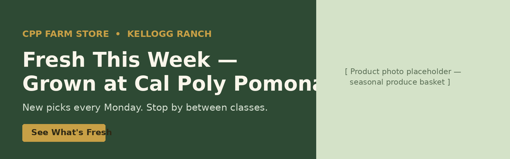

## Overview

This creative brief translates the **GP4 Campaign Plan** ("Fresh This Week — Grown at Cal Poly Pomona") into campaign-ready creative direction and sample assets. Every element below traces back to the objective, audience, and message strategy already approved in GP4, and to the online-awareness / in-store-conversion gap identified in the GP1 journey map.

## Creative Objective

**Primary objective:** Drive weekly, repeat visits to CPP Farm Store by making the store's rotating, campus-grown inventory visible to students where they already spend their attention — turning "I didn't know we had a farm store" into "let me see what's fresh this week."

**Supporting objectives (from GP4):**

- Encourage students to visit CPP Farm Store between classes
- Highlight that products are grown and made on campus (not just "local," but *this* campus)
- Introduce Farm Rewards as a reason to come back weekly
- Build a light gifting angle for the secondary audience (faculty, staff, parents)

## Target Audience

We are not designing for "everyone." Two audiences carry the creative, in priority order:

**Primary — CPP undergrad and graduate students living or spending most of their day on/near campus (Kellogg Ranch corridor).** Time-crunched between classes, budget-conscious, mobile-first, and — per the GP1 journey map — largely unaware the Farm Store exists or unsure of its hours/location. They are motivated by convenience (it's on the way, not a special trip), novelty (what's fresh *this week*), and campus pride (this is grown by their own university).

**Secondary — faculty, staff, and campus visitors/parents looking for a local gift.** Motivated less by convenience and more by authenticity and story — a gift that says "this came from Cal Poly Pomona," not a generic supermarket basket.

The creative below is built for the primary audience first; the gifting message is carried by one asset (email) so it doesn't dilute the core "Fresh This Week" hook.

## Key Message

> **"Fresh This Week — Grown at Cal Poly Pomona."**

This is short, ownable, and does two jobs at once: it names the audience's benefit (fresh, rotating product) and the store's unique proof point (grown on the very campus students attend). The phrase "This Week" also builds in a reason to keep checking back, which is the whole point of a recurring content series rather than a one-off ad.

**Funnel-stage variants** (carried over from GP4, reused across assets below so the campaign feels consistent rather than re-invented per channel):

| Funnel stage | Message |
|----|----|
| Awareness | "Your campus grows food. Come taste it." |
| Discovery (search/Maps) | "CPP Farm Store — fresh produce, local honey, and CPP Farms ice cream at Kellogg Ranch." |
| Conversion | "See what's fresh this week, then swing by between classes." |
| Gifting | "Campus-grown gifts, made at CPP." |
| Retention | "Earn Farm Rewards every visit." |

## Tone and Style

- **Friendly, not corporate** — copy reads like a classmate telling you about a good find, not a retail ad
- **Local and specific** — always "Cal Poly Pomona" / "Kellogg Ranch," never generic "local farm" language
- **Fresh and seasonal** — content changes weekly by design; nothing here should read as evergreen stock copy
- **Practical** — every asset answers "what, where, when" quickly, since the GP1 gap was awareness of hours/location, not interest
- **Student-friendly** — short sentences, casual verbs ("swing by," "stop by"), minimal jargon

**Visual style:** campus greens and warm neutrals (carried from the Shopify prototype's palette), real produce/product photography over stock imagery, and simple bold typography that reads at a glance on a phone screen.

## Channel Recommendations

| Channel | Role | Why it fits |
|----|----|----|
| Instagram (feed + Stories) | Awareness + weekly content series | Highest-reach platform with this audience; visual format suits produce and behind-the-scenes content; Stories support countdown stickers and location tags |
| Email (Farm Rewards list) | Retention + gifting | Reaches people who have already visited once; supports a slightly longer, benefit-driven message that Instagram can't carry |
| Website banner (Shopify prototype) | Conversion | Captures anyone who clicks through from an ad, Google listing, or QR code and needs an immediate "what's fresh" answer |
| In-store signage | Conversion + repeat-visit reminder | Reinforces the weekly hook for people already on campus, and gives Farm Rewards a physical prompt at the point of purchase |

This satisfies the assignment minimum (3+ assets, 2+ channels) with assets built across four channels below.

## Sample Creative Assets

### Asset 1 — Instagram Feed Post

**Channel:** Instagram (feed) **Purpose:** Weekly awareness post, first entry in the "Fresh This Week" recurring series

**Visual concept:** A single well-lit photo of this week's featured items (e.g., a produce basket with CPP Farms honey), shot flat-lay style against a wood or burlap background, with a small on-image tag reading "Fresh This Week."

**Caption copy:**

> 🌱 Fresh This Week at CPP Farm Store: strawberries, heirloom tomatoes, and a new batch of CPP Farms honey — all grown right here at Kellogg Ranch.
>
> Stop by between classes. New picks drop every Monday. 📍 Kellogg Ranch, open \[hours\]
>
> #CPPFarmStore #FreshThisWeek #CalPolyPomona

### Asset 2 — Instagram Story

**Channel:** Instagram (Stories) **Purpose:** Real-time, lower-effort awareness touchpoint that drives immediate foot traffic

**Visual concept:** Vertical photo/video of staff restocking or a close-up of a featured product, with a countdown sticker ("2 days left of this week's picks") and a location sticker pinned to Kellogg Ranch.

**On-screen text:**

> This week's harvest is almost gone 🍯 Swing by before Friday → \[Location sticker: CPP Farm Store, Kellogg Ranch\]

### Asset 3 — Email (Farm Rewards list)

**Channel:** Email **Purpose:** Retention for past visitors, with a secondary gifting nudge

**Subject line:** *Fresh This Week — and 250 bonus Farm Rewards points 🌾*

**Body copy:**

> Hi \[First Name\],
>
> This week's Farm Store picks just went out: strawberries, heirloom tomatoes, and a fresh batch of CPP Farms honey — all grown right here on campus.
>
> Stop by Kellogg Ranch this week and earn 5 points per \$1 on your Farm Rewards card. Members who visit twice this month unlock a free honey jar.
>
> Shopping for someone else? Our seasonal gift bundles are campus-grown and ready to wrap.
>
> **\[See What's Fresh →\]**
>
> — CPP Farm Store

### Asset 4 — Website Banner (Shopify prototype homepage)

**Channel:** Website (GP2 Shopify prototype) **Purpose:** Conversion — the landing point for anyone arriving from Instagram, Google, or a QR code

**Concept:** Full-width homepage banner pairing the campaign headline with a direct call-to-action button linking to this week's featured collection.

{#fig-banner width="90%"}

## AI Prompt Documentation

Per the assignment requirement, all AI-assisted copy in this brief was generated, then reviewed and edited by the group before inclusion.

**Tool used:** Claude (Anthropic)

**Example prompts used:**

- "Write a short, friendly Instagram caption for a campus farm store announcing this week's featured produce, using the tagline 'Fresh This Week — Grown at Cal Poly Pomona.'"
- "Draft an email subject line and body for a farm store loyalty program, encouraging a repeat visit this week and mentioning a rewards point bonus."
- "Suggest a short line of on-screen text for an Instagram Story countdown encouraging students to visit before the week's stock runs out."

**Original AI output (summary):** The first-pass captions and email draft were longer and more formal than what appears above — the initial Instagram caption ran three sentences and used phrasing like "we are delighted to showcase this week's harvest," and the email draft opened with a generic "Dear valued customer."

**Edits made by the group:**

- Shortened all copy to fit mobile-first, scan-in-two-seconds reading habits
- Replaced formal/corporate phrasing ("we are delighted to showcase") with casual, student-facing language ("stop by between classes")
- Added the specific location cue ("Kellogg Ranch") to every asset, since GP1 identified location/hours confusion as a real barrier
- Personalized the email greeting and tied the CTA directly to the Farm Rewards mechanic already documented in GP4
- Removed a specific numeric claim ("locally rated #1") the AI draft had invented with no source

**Reason for edits:** The unedited drafts read as generic small-business marketing copy — accurate in spirit but not specific to CPP, not sized for the channels they'd run on, and in one case containing an unverifiable claim. Editing grounded every asset in facts already established across GP1–GP4 (the awareness gap, the GP3 product feed, the Farm Rewards program).

**Brand-fit explanation:** CPP Farm Store's identity rests on being *campus-grown*, not generically "local." Every edit pushed the copy toward that specificity — naming Kellogg Ranch, referencing the weekly rotation, and avoiding language that could describe any farm stand anywhere.

## Ethical and Practical Considerations

- **Accuracy of product claims:** All copy above references only products and programs already documented in GP2–GP4 (produce, honey, CPP Farms ice cream, Farm Rewards). No pricing, quantities, or availability claims are made that the store would need to independently verify before this creative goes live — the original AI-invented "#1 locally rated" claim was removed for this reason.
- **Use of real brand identity:** These assets use the CPP Farm Store name and the "Fresh This Week" tagline developed by this group in GP4. They should not be published externally until reviewed by an actual store representative, since this remains a course project, not an approved store campaign.
- **Image ownership/licensing:** The banner mockup above is a layout concept generated for this assignment and explicitly labeled as a placeholder — it does not depict a real, licensed product photo. Before production use, the product panel would need to be replaced with an actual photo taken by or licensed to CPP Farm Store.
- **Avoiding misleading visuals:** Any real photography used in place of the placeholder should depict actual current inventory, not a staged image implying a permanent product that may not be in stock the following week — the "this week" premise only works if the imagery stays honest about rotation.
- **Respecting CPP Farm Store's reputation:** Tone was kept warm and community-oriented rather than aggressive or sales-heavy, consistent with a campus-run store rather than a commercial retailer.
- **Conceptual vs. ready-to-use:** All four assets are **conceptual drafts** suitable for course submission and internal review. None are ready to publish as-is — captions would need final photography, the email needs integration into the store's actual email platform, and the banner needs a real product photo before it could go live on the Shopify site.

## How These Assets Support the Campaign Plan

Each asset maps directly to a piece of the GP4 Campaign Plan rather than standing alone:

- The Instagram post and Story deliver on GP4's Instagram awareness channel and reuse the exact "Fresh This Week" funnel-stage message
- The email activates the Farm Rewards retention mechanic GP4 already proposed, and adds the gifting message for the secondary audience without needing a separate campaign
- The website banner gives GP4's channel strategy a real landing destination on the GP2 Shopify prototype, closing the loop between "see an ad" and "arrive at a page that matches it"
- Together, they cover awareness (Instagram), retention (email), and conversion (website + in-store), matching the funnel structure already defined in GP4's channel strategy table

## Appendix

- **GitHub Repository (GP5 folder):** [github.com/mjshawell/cpp-farm-store-theme/tree/main/assignments/GP5](https://github.com/mjshawell/cpp-farm-store-theme/tree/main/assignments/GP5)
- **GitHub Pages (this report):** *add after publishing — pattern: `https://mjshawell.github.io/cpp-farm-store-theme/assignments/GP5/SeisLeches-GP5-Creative-Brief.html`*
- **GP1 Omnichannel Journey Map:** [mjshawell.github.io/cpp-farm-store-theme/assignments/Group6-GP1-Omni-map.html](https://mjshawell.github.io/cpp-farm-store-theme/assignments/Group6-GP1-Omni-map.html)
- **GP2 Mini-Store Prototype Report:** [mjshawell.github.io/cpp-farm-store-theme/assignments/GP2/Seis-Leches-GP2-Mini-Store-Prototype.html](https://mjshawell.github.io/cpp-farm-store-theme/assignments/GP2/Seis-Leches-GP2-Mini-Store-Prototype.html)
- **GP3 Product Media Report:** [mjshawell.github.io/cpp-farm-store-theme/assignments/GP3/SeisLeches-GP3-Product-Media.html](https://mjshawell.github.io/cpp-farm-store-theme/assignments/GP3/SeisLeches-GP3-Product-Media.html)
- **GP4 Campaign Plan:** [mjshawell.github.io/cpp-farm-store-theme/assignments/GP4/SeisLeches-GP4-Campaign-Plan.html](https://mjshawell.github.io/cpp-farm-store-theme/assignments/GP4/SeisLeches-GP4-Campaign-Plan.html)
- **Shopify dev store:** [cpp-farm-store-dev.myshopify.com](https://cpp-farm-store-dev.myshopify.com) (password: `tairtu`)
