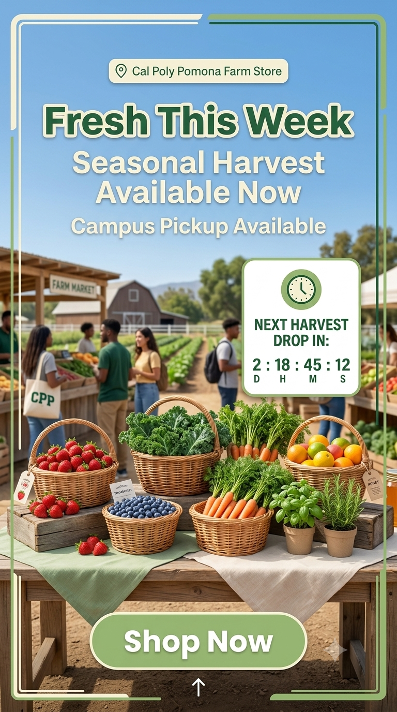
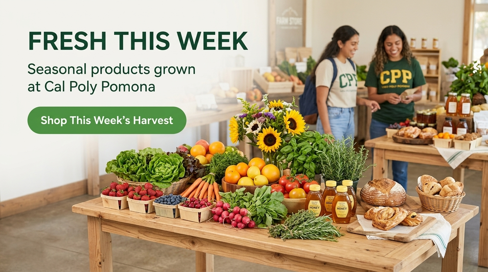

## Overview

This creative brief translates the **GP4 Campaign Plan** ("Fresh This Week — Grown at Cal Poly Pomona") into campaign-ready creative direction and sample assets. Every element below traces back to the objective, audience, and message strategy already approved in GP4, and to the online-awareness / in-store-conversion gap identified in the GP1 journey map.

## Creative Objective

**Primary objective:** Drive weekly, repeat visits to CPP Farm Store by making the store's rotating, campus-grown inventory visible to students where they already spend their attention — turning "I didn't know we had a farm store" into "let me see what's fresh this week."

**Supporting objectives (from GP4):**

- Encourage students to visit CPP Farm Store between classes
- Highlight that products are grown and made on campus (not just "local," but *this* campus)
- Introduce Farm Rewards as a reason to come back weekly
- Build a light gifting angle for the secondary audience (faculty, staff, parents)

## Target Audience

We are not designing for "everyone." Two audiences carry the creative, in priority order:

**Primary — CPP undergrad and graduate students living or spending most of their day on/near campus (Kellogg Ranch corridor).** Time-crunched between classes, budget-conscious, mobile-first, and — per the GP1 journey map — largely unaware the Farm Store exists or unsure of its hours/location. They are motivated by convenience (it's on the way, not a special trip), novelty (what's fresh *this week*), and campus pride (this is grown by their own university).

**Secondary — faculty, staff, and campus visitors/parents looking for a local gift.** Motivated less by convenience and more by authenticity and story — a gift that says "this came from Cal Poly Pomona," not a generic supermarket basket.

The creative below is built for the primary audience first; the gifting message is carried by one asset (email) so it doesn't dilute the core "Fresh This Week" hook.

## Key Message

> **"Fresh This Week — Grown at Cal Poly Pomona."**

This is short, ownable, and does two jobs at once: it names the audience's benefit (fresh, rotating product) and the store's unique proof point (grown on the very campus students attend). The phrase "This Week" also builds in a reason to keep checking back, which is the whole point of a recurring content series rather than a one-off ad.

**Funnel-stage variants** (carried over from GP4, reused across assets below so the campaign feels consistent rather than re-invented per channel):

| Funnel stage | Message |
|----|----|
| Awareness | "Your campus grows food. Come taste it." |
| Discovery (search/Maps) | "CPP Farm Store — fresh produce, local honey, and CPP Farms ice cream at Kellogg Ranch." |
| Conversion | "See what's fresh this week, then swing by between classes." |
| Gifting | "Campus-grown gifts, made at CPP." |
| Retention | "Earn Farm Rewards every visit." |

## Tone and Style

- **Friendly, not corporate** — copy reads like a classmate telling you about a good find, not a retail ad
- **Local and specific** — always "Cal Poly Pomona" / "Kellogg Ranch," never generic "local farm" language
- **Fresh and seasonal** — content changes weekly by design; nothing here should read as evergreen stock copy
- **Practical** — every asset answers "what, where, when" quickly, since the GP1 gap was awareness of hours/location, not interest
- **Student-friendly** — short sentences, casual verbs ("swing by," "stop by"), minimal jargon

**Visual style:** campus greens and warm neutrals (carried from the Shopify prototype's palette), real produce/product photography over stock imagery, and simple bold typography that reads at a glance on a phone screen.

## Channel Recommendations

| Channel | Role | Why it fits |
|----|----|----|
| Instagram (feed + Stories) | Awareness + weekly content series | Highest-reach platform with this audience; visual format suits produce and behind-the-scenes content; Stories support countdown stickers and location tags |
| Email (Farm Rewards list) | Retention + gifting | Reaches people who have already visited once; supports a slightly longer, benefit-driven message that Instagram can't carry |
| Website banner (Shopify prototype) | Conversion | Captures anyone who clicks through from an ad, Google listing, or QR code and needs an immediate "what's fresh" answer |
| In-store signage | Conversion + repeat-visit reminder | Reinforces the weekly hook for people already on campus, and gives Farm Rewards a physical prompt at the point of purchase |

This satisfies the assignment minimum (3+ assets, 2+ channels) with assets built across four channels below.

## Sample Creative Assets

The following four assets translate the campaign strategy developed in GP4 into coordinated executions across Instagram, email, and the Shopify storefront. Although each asset is adapted to its channel, all four use the same **Fresh This Week** campaign theme, campus-grown positioning, visual style, and location-based messaging.

### Asset 1 — Instagram Feed Post

**Channel:** Instagram Feed

**Purpose:** Build weekly awareness of rotating seasonal products and encourage students to visit the CPP Farm Store or explore the online storefront.

**Visual concept:** A mobile-first promotional post featuring this week's seasonal products in a clean, farm-fresh layout that reflects the green and warm-neutral palette used in the Shopify prototype.

{#fig-instagram-post fig-align="center" width="55%"}

**Caption copy:**

> 🌱 **Fresh This Week at CPP Farm Store**
>
> Discover seasonal produce, CPP Farms honey, and campus-grown favorites available this week at Kellogg Ranch.
>
> Stop by between classes or explore the CPP Farm Store online.
>
> 📍 CPP Farm Store, Kellogg Ranch
>
> #CPPFarmStore #FreshThisWeek #CalPolyPomona

*Figure @fig-instagram-post presents the campaign's primary Instagram feed asset. Its concise copy, product-centered imagery, and campus-specific location message address the awareness and discovery barriers identified in GP1.*

### Asset 2 — Instagram Story

**Channel:** Instagram Stories

**Purpose:** Create urgency around rotating inventory and encourage immediate visits from students already on or near campus.

**Visual concept:** A vertical, mobile-first Story design featuring seasonal products, brief promotional copy, and a clear call to action. The format supports interactive Instagram elements such as a location tag, countdown sticker, or link sticker.

{#fig-instagram-story fig-align="center" width="40%"}

**On-screen copy:**

> **Fresh This Week**
>
> Seasonal favorites are available now.
>
> Visit the CPP Farm Store at Kellogg Ranch.
>
> **Shop Now**

*Figure @fig-instagram-story supports the campaign's awareness and conversion goals by presenting a message that can be understood quickly on a mobile screen. Before publication, the store could add a live location sticker, countdown sticker, or direct link to the Shopify storefront.*

### Asset 3 — Email Campaign

**Channel:** Email

**Purpose:** Encourage repeat visits among previous customers and Farm Rewards members while introducing seasonal products and campus-grown gift options.

{#fig-email-header fig-align="center" width="90%"}

**Subject line:** *Fresh This Week at CPP Farm Store 🌾*

**Preview text:** Discover this week's campus-grown products and seasonal favorites.

**Body copy:**

> Hi [First Name],
>
> This week's Farm Store selections are ready. Explore seasonal produce, CPP Farms honey, and other products grown or made right here at Cal Poly Pomona.
>
> Stop by Kellogg Ranch this week and continue earning Farm Rewards points with every eligible purchase.
>
> Shopping for someone else? Our seasonal gift bundles offer a campus-grown option for faculty, staff, family members, and visitors.
>
> **[See What's Fresh →]**
>
> — CPP Farm Store

*Figure @fig-email-header provides a consistent visual introduction to the email campaign. The email supports retention by giving past customers a reason to return while directing recipients to the Shopify storefront for additional product discovery.*

### Asset 4 — Website Banner

**Channel:** Shopify website homepage

**Purpose:** Convert traffic arriving from Instagram, email, Google, or QR codes by immediately communicating the campaign theme and providing a clear path to featured products.

**Visual concept:** A full-width homepage hero banner that pairs the campaign headline with seasonal product imagery and a direct call-to-action button.

{#fig-homepage-banner fig-align="center" width="95%"}

**Headline:** Fresh This Week

**Supporting copy:** Discover seasonal products grown and made at Cal Poly Pomona.

**Call to action:** **Shop This Week's Harvest**

**Intended destination:** The call-to-action button would direct visitors to the Shopify store's featured or seasonal product collection.

*Figure @fig-homepage-banner represents the campaign's main website conversion asset. It creates continuity between off-site campaign messages and the Shopify experience developed in GP2.*

## AI Prompt Documentation

AI tools assisted with the first drafts of campaign copy and the creation of visual mockups. All outputs were reviewed, edited, and organized by the group before being included in this report.

| Documentation item | Details |
|---|---|
| Tools used | Claude for initial copy development and Google Gemini for visual mockup generation |
| Purpose | Generate initial concepts for Instagram, email, and website campaign assets |
| Human review | Group members checked wording, product claims, brand consistency, layout, and channel fit |
| Final status | Conceptual course-project assets that require store approval before external publication |

### Copy-generation documentation

**Tool used:** Claude (Anthropic)

**Example prompts used:**

- "Write a short, friendly Instagram caption for a campus farm store announcing this week's featured produce, using the tagline 'Fresh This Week — Grown at Cal Poly Pomona.'"
- "Draft an email subject line and body for a farm store loyalty program, encouraging a repeat visit this week and mentioning a rewards point bonus."
- "Suggest a short line of on-screen text for an Instagram Story countdown encouraging students to visit before the week's stock runs out."

### Image-generation documentation

**Tool used:** Google Gemini

**Example prompts used:**

- "Create a photorealistic Instagram feed post for the Cal Poly Pomona Farm Store promoting the Fresh This Week campaign. Use a clean ecommerce layout, green and cream accents, seasonal produce, campus-grown product messaging, and a student-friendly visual style."
- "Create a vertical Instagram Story for the Cal Poly Pomona Farm Store featuring seasonal products, a Fresh This Week headline, a Shop Now call to action, and a clean mobile-first layout consistent with a modern Shopify storefront."
- "Create a professional email marketing header for the Cal Poly Pomona Farm Store using seasonal produce, warm natural lighting, green and cream brand colors, and the Fresh This Week campaign theme."
- "Create a wide homepage hero banner for the Cal Poly Pomona Farm Store Shopify website. Include fresh seasonal products, modern ecommerce typography, the Fresh This Week headline, and a Shop This Week's Harvest call-to-action button."

**Original AI output summary:** Gemini produced initial visual concepts based on the requested layouts, messaging, product imagery, and farm-inspired visual direction. Some elements, including product arrangements, typography, buttons, and backgrounds, were generated conceptually rather than copied directly from the current Shopify prototype.

**Edits and selection decisions made by the group:**

- Selected the images that most closely matched the green, cream, and warm-neutral palette of the Shopify prototype
- Rejected overly decorative or unrealistic farm-market visuals
- Chose layouts with readable typography and clear calls to action
- Kept the same Fresh This Week campaign message across all assets
- Added explanatory captions and channel context in the report
- Labeled the assets as conceptual rather than presenting them as approved CPP marketing materials

**Reason for edits:** The first AI-generated concepts did not always match the store's existing ecommerce style or the practical needs of each channel. The group selected and refined the strongest concepts to improve consistency, readability, and alignment with the CPP Farm Store campaign.

**Brand-fit explanation:** The selected assets use seasonal-product imagery, natural lighting, green and neutral colors, simple typography, and campus-specific messaging. These choices reflect the approachable and farm-fresh identity established in the Shopify prototype while supporting the student-focused creative strategy developed in GP4.

### Copy output, editing, and brand-fit review

**Original AI output (summary):** The first-pass captions and email draft were longer and more formal than what appears above — the initial Instagram caption ran three sentences and used phrasing like "we are delighted to showcase this week's harvest," and the email draft opened with a generic "Dear valued customer."

**Edits made by the group:**

- Shortened all copy to fit mobile-first, scan-in-two-seconds reading habits
- Replaced formal/corporate phrasing ("we are delighted to showcase") with casual, student-facing language ("stop by between classes")
- Added the specific location cue ("Kellogg Ranch") to every asset, since GP1 identified location/hours confusion as a real barrier
- Personalized the email greeting and tied the CTA directly to the Farm Rewards mechanic already documented in GP4
- Removed a specific numeric claim ("locally rated #1") the AI draft had invented with no source

**Reason for edits:** The unedited drafts read as generic small-business marketing copy — accurate in spirit but not specific to CPP, not sized for the channels they'd run on, and in one case containing an unverifiable claim. Editing grounded every asset in facts already established across GP1–GP4 (the awareness gap, the GP3 product feed, the Farm Rewards program).

**Brand-fit explanation:** CPP Farm Store's identity rests on being *campus-grown*, not generically "local." Every edit pushed the copy toward that specificity — naming Kellogg Ranch, referencing the weekly rotation, and avoiding language that could describe any farm stand anywhere.

## Ethical and Practical Considerations

- **Accuracy of product claims:** All copy above references only products and programs already documented in GP2–GP4 (produce, honey, CPP Farms ice cream, Farm Rewards). No pricing, quantities, or availability claims are made that the store would need to independently verify before this creative goes live — the original AI-invented "#1 locally rated" claim was removed for this reason.
- **Use of real brand identity:** These assets use the CPP Farm Store name and the "Fresh This Week" tagline developed by this group in GP4. They should not be published externally until reviewed by an actual store representative, since this remains a course project, not an approved store campaign.
- **Image ownership and AI generation:** The four mockups included in this report were generated with Google Gemini for a course project. They are presented as conceptual campaign assets rather than official CPP Farm Store materials. Before commercial or public use, the group would need to review Gemini's applicable usage terms, confirm that all visual elements are permitted for the intended use, and replace conceptual product imagery with approved or licensed CPP Farm Store photography where appropriate.
- **Avoiding misleading visuals:** The AI-generated mockups may depict conceptual arrangements or products that do not exactly match current store inventory. Final campaign assets should use verified product photographs and current availability information so customers are not led to expect items that are unavailable.
- **Respecting CPP Farm Store's reputation:** Tone was kept warm and community-oriented rather than aggressive or sales-heavy, consistent with a campus-run store rather than a commercial retailer.
- **Accessibility:** Final assets should use readable font sizes, sufficient text-to-background contrast, descriptive alternative text, and concise copy. Important information should not be communicated through imagery or color alone.
- **Conceptual vs. ready-to-use:** All four assets remain conceptual drafts created for course submission and strategic review. The layouts and messaging could guide future production, but the images, inventory references, links, store information, and brand use would require verification and approval before publication.

## How These Assets Support the Campaign Plan

Each asset maps directly to a piece of the GP4 Campaign Plan rather than standing alone:

- The Instagram post and Story deliver on GP4's Instagram awareness channel and reuse the exact "Fresh This Week" funnel-stage message
- The email activates the Farm Rewards retention mechanic GP4 already proposed, and adds the gifting message for the secondary audience without needing a separate campaign
- The website banner gives GP4's channel strategy a real landing destination on the GP2 Shopify prototype, closing the loop between "see an ad" and "arrive at a page that matches it"
- Together, they cover awareness (Instagram), retention (email), and conversion (website + in-store), matching the funnel structure already defined in GP4's channel strategy table

The assets also demonstrate the progression of the group's overall project. GP1 identified customer awareness, location, and product-discovery barriers. GP2 responded with a Shopify mini-store prototype. GP3 improved digital product visibility through product-feed planning. GP4 established the campaign strategy, and GP5 converts that strategy into coordinated creative executions. Together, the assignments create a connected path from customer insight to storefront development, media planning, campaign strategy, and creative production.

## Appendix

- **GitHub Repository (GP5 folder):** [github.com/mjshawell/cpp-farm-store-theme/tree/main/assignments/GP5](https://github.com/mjshawell/cpp-farm-store-theme/tree/main/assignments/GP5)
- **GitHub GP5 Page Report:** [github.com/mjshawell/cpp-farm-store-theme/tree/main/assignments/GP5/SeisLeches-GP5-Creative-Brief.html](https://mjshawell.github.io/cpp-farm-store-theme/assignments/GP5/SeisLeches-GP5-Creative-Brief.html)
- **GP1 Omnichannel Journey Map:** [mjshawell.github.io/cpp-farm-store-theme/assignments/Group6-GP1-Omni-map.html](https://mjshawell.github.io/cpp-farm-store-theme/assignments/Group6-GP1-Omni-map.html)
- **GP2 Mini-Store Prototype Report:** [mjshawell.github.io/cpp-farm-store-theme/assignments/GP2/Seis-Leches-GP2-Mini-Store-Prototype.html](https://mjshawell.github.io/cpp-farm-store-theme/assignments/GP2/Seis-Leches-GP2-Mini-Store-Prototype.html)
- **GP3 Product Media Report:** [mjshawell.github.io/cpp-farm-store-theme/assignments/GP3/SeisLeches-GP3-Product-Media.html](https://mjshawell.github.io/cpp-farm-store-theme/assignments/GP3/SeisLeches-GP3-Product-Media.html)
- **GP4 Campaign Plan:** [mjshawell.github.io/cpp-farm-store-theme/assignments/GP4/SeisLeches-GP4-Campaign-Plan.html](https://mjshawell.github.io/cpp-farm-store-theme/assignments/GP4/SeisLeches-GP4-Campaign-Plan.html)
- **Shopify dev store:** [cpp-farm-store-dev.myshopify.com](https://cpp-farm-store-dev.myshopify.com) (password: `tairtu`)
