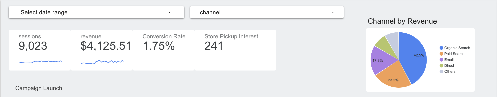
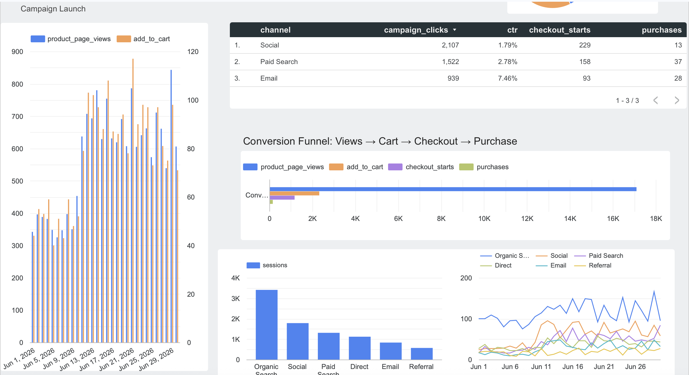
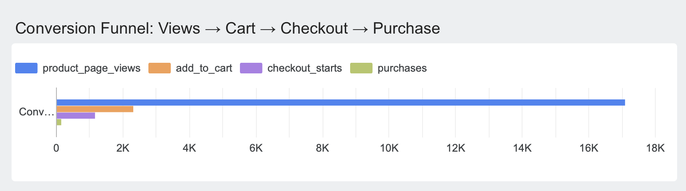

## Overview

This dashboard evaluates how CPP Farm Store could measure the success of its
omnichannel "Fresh This Week — Grown at Cal Poly Pomona" campaign (established
in GP4) and the ecommerce experience built out in GP2/GP3. Because CPP Farm
Store's live Shopify Prototype (GP2) — ecommerce pages and simulated customer journey store does not yet have production GA4 traffic, this
report uses a **simulated GA4-style dataset**, clearly labeled as such
throughout.

This report represents the final measurement stage of the semester-long consulting project. GP1 identified customer journey challenges, GP2 developed the Shopify Prototype (GP2) — ecommerce pages and simulated customer journey storefront, GP3 expanded digital product visibility through Google Merchant Center (GP3) — product categories and campaign structure, GP4 created the **Fresh This Week** campaign strategy, GP5 developed campaign-ready creative assets, and GP6 evaluates the effectiveness of those efforts using a simulated GA4 reporting framework.

**Key question:** How should CPP Farm Store measure the success of its
omnichannel campaign and ecommerce efforts?

## Dashboard Users

The dashboard is designed for:

- **CPP Farm Store manager** — high-level performance and revenue trends
- **Marketing/campaign manager (our consulting team)** — channel-level campaign performance
- **Ecommerce manager** — product page engagement and checkout funnel behavior

Each audience needs a different depth of detail, which is why the dashboard is
organized into an executive summary layer plus deeper diagnostic sections.

## Measurement Objectives

Tied directly to the GP4 campaign plan and GP3 product feed:

- Measure website traffic before vs. after the "Fresh This Week" campaign launch
- Track product page engagement across the 6 GMC product categories
- Monitor paid, social, and email campaign performance
- Compare channel effectiveness (Organic, Paid Search, Social, Email, Direct, Referral)
- Track conversion behavior
- Evaluate which campaign assets (Instagram, Email, Website Banner) generated the strongest customer response through the funnel (view → cart → checkout → purchase)
- Measure store pickup interest as a proxy for omnichannel (online-to-offline) success

## KPIs Selected

| KPI | Why it matters |
|---|---|
| Sessions / Users | Baseline traffic volume, campaign reach |
| New vs. Returning Visitors | Campaign's ability to attract new customers vs. retain existing ones |
| Product Page Views | Interest in specific product categories from GP3 feed |
| Add-to-Cart Rate | Early purchase intent |
| Checkout Starts | Funnel drop-off diagnostic |
| Purchases / Conversion Rate | Bottom-line campaign effectiveness |
| Revenue | Simulated revenue impact of the campaign |
| Campaign Clicks / CTR | Paid Search, Social, Email ad performance |
| Email Signups | Lower-funnel engagement / retention pipeline |
| Store Pickup Interest | Omnichannel behavior — online research, offline pickup |

KPIs were chosen to answer specific business questions from the campaign plan
rather than included simply because they were available in the dataset.

## Data Sources

- **GA4 (simulated):** 30 days of session, engagement, and funnel data across
  6 traffic channels (June 1–30, 2026), reflecting a campaign launch around
  day 10. *Simulated — no live GA4 property connected to the CPP Farm Store
  Shopify Prototype (GP2) — ecommerce pages and simulated customer journey store yet.*
- **Shopify Prototype (GP2) — ecommerce pages and simulated customer journey (GP2):** informs which pages/products are being measured
- **Google Merchant Center (GP3) — product categories and campaign structure (GP3):** informs the 6 product categories tracked
  in the product performance section
- **Campaign plan (GP4):** informs which channels and KPIs matter

## Dashboard Sections

1. **Executive Summary** — top-line scorecards (sessions, revenue, conversion rate, store pickup interest)
2. **Traffic Acquisition** — sessions/users by channel, trended daily, before/after campaign launch
3. **Product Performance** — product page views and add-to-cart by category
4. **Campaign Performance** — clicks, CTR, and spend efficiency by paid channel
5. **Customer Behavior Funnel** — view → cart → checkout → purchase, with drop-off rates
6. **Recommendations / Action Items**

## Dashboard Link

<!-- Replace with your published Looker Studio share link (set to "Anyone with the link can view") -->
🔗 [Looker Studio Dashboard](https://datastudio.google.com/reporting/90119bc5-4611-4833-ac99-86fe4d46b535)

## Interpretation

**What is performing well?**
Paid Search is the strongest campaign channel in the dashboard, generating the
highest click-through rate among the three paid/campaign channels tracked
(Paid Search, Social, Email). Traffic overall shows a clear lift following the
"Fresh This Week" campaign launch on June 10 — visible directly in the
Traffic Acquisition trend chart, where all channel lines step up after the
marked launch point.

**What needs improvement?**
The customer behavior funnel shows steep drop-off at every stage: of 382
product page views, only 59 resulted in an add-to-cart (~15%), 26 of those
progressed to checkout (~44%), and just 3 converted to a purchase (~12% of
checkout starts). The steepest single drop is between product page views and
add-to-cart — meaning most visitors are browsing but not engaging with
specific products enough to act. This is the highest-leverage stage to
address.

**Which product or channel deserves more attention?**
Paid Search deserves the most attention going forward — it converts checkout
starts to purchases better than Social or Email in the campaign performance
table, despite Social generating more raw clicks. Reallocating a larger share
of the campaign budget toward Paid Search, while testing why Social traffic
isn't converting at a comparable rate, is the clearest opportunity in the
data.

**What should CPP Farm Store do next?**
Building on the GP4 campaign plan, the next step is to address the
page-view-to-cart drop-off directly — for example, testing clearer
call-to-action placement on product pages, or highlighting the "Grown at Cal
Poly Pomona" story closer to the add-to-cart button to reinforce the local
sourcing message from the campaign. On the channel side, shifting incremental
budget toward Paid Search (where it is currently outperforming Social and
Email on conversion) is a low-risk next move.

**Data limitations:**
This dashboard uses simulated GA4 data because CPP Farm Store's Shopify Prototype (GP2) — ecommerce pages and simulated customer journey store
is a development-stage practice site without live customer traffic. Absolute
numbers (sessions, revenue, purchases) are illustrative rather than actual
performance; the KPI structure, funnel logic, and channel comparisons are
what should carry over once a real GA4 property is connected post-launch.

## Recommended Actions

- Continue expanding Organic Search optimization because it generated the highest simulated traffic and revenue throughout the reporting period.

- Reallocate a larger share of campaign budget toward Paid Search, which
  currently shows the strongest click-to-purchase performance of the three
  paid channels.
- Investigate the page-view → add-to-cart drop-off (~85% of viewers do not
  add to cart) — likely the single highest-impact area to improve through UX
  or messaging changes on product pages.
- Test stronger in-page reinforcement of the "Fresh This Week — Grown at Cal
  Poly Pomona" messaging directly on product pages, not just in ads, to
  connect campaign intent with on-site behavior.
- Monitor Social channel separately from Paid Search — it drives comparable
  click volume but converts at a lower rate, suggesting a targeting or
  landing-page mismatch worth diagnosing before increasing its budget.
- Once a live GA4 property is connected, prioritize tracking store pickup
  interest as the true omnichannel success metric, since it reflects
  online-to-offline behavior unique to CPP Farm Store's model.

## Appendix

- Looker Studio Dashboard
- Shopify Prototype

## Appendix

- Looker Studio Dashboard
- Shopify Prototype

- **GitHub Repository:** [mjshawell/cpp-farm-store-theme — GP6](https://github.com/mjshawell/cpp-farm-store-theme/tree/main/assignments/GP6)
- **GitHub Pages:** [Live Site](https://mjshawell.github.io/cpp-farm-store-theme/assignments/GP6/GP6-CPP-Farm-Store-GA4-Looker-Dashboard.html)
- **Simulated GA4 Dataset (CSV):** included in `assignments/GP6/data/ga4_simulated_data.csv`
